# pwn.tn - f_two

Origin challenge link: https://pwn.tn/challenges

You can also download the challenge at my repo: [f_two.zip](https://github.com/nhtri2003gmail/writeup-pwn.tn-f_one/blob/master/f_two.zip)

The f_two.zip file will include 1 file:

- f_two

# 1. Find bug

First, let's check the information of the challenge using `file`:

```
f_two: ELF 32-bit LSB executable, Intel 80386, version 1 (SYSV), dynamically linked, interpreter /lib/ld-linux.so.2, for GNU/Linux 3.2.0, BuildID[sha1]=0109660cebb3692f5a78a67c1d92f5f23dd74249, not stripped
```

This is a 32-bit without being stripped.

Next, let's check security information using `checksec`:

```
Arch:     i386-32-little
RELRO:    Partial RELRO
Stack:    Canary found
NX:       NX enabled
PIE:      No PIE (0x8048000)
```

We can see NX are on and there is canary on stack, which maybe hard for us to exploit.

Let's fire up ghidra, decompile program and rename some variables to know clearly the workflow. There is main(), header(), form() and footer(). All function are not interesting except form():

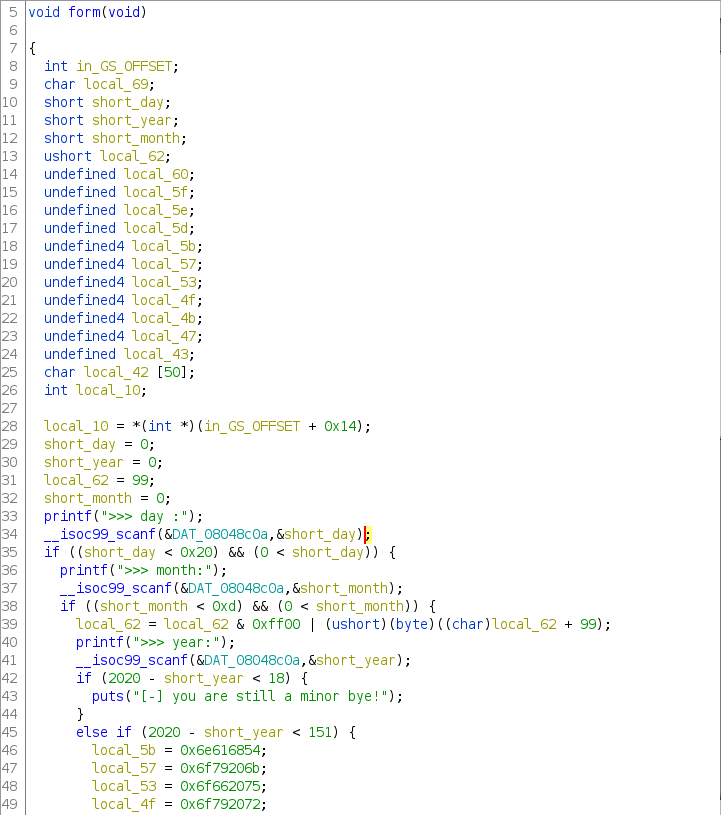

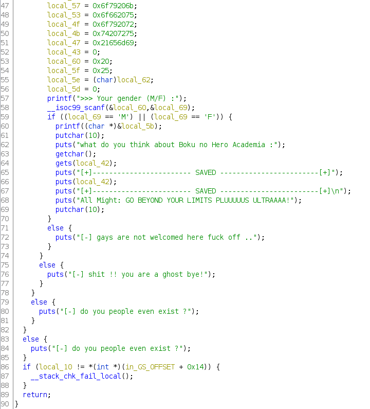

With a first look, we can see that at line 64, gets() doens't limit the input --> buffer overflow

And what next? If there is just a buffer overflow, but with stack canary, we cannot overwrite eip because stack canary always before ebp and eip. Maybe some of the previous input can do some interesting things.

Let's look at scanf(), the variable `DAT_08048c0a` has value which is `%d`

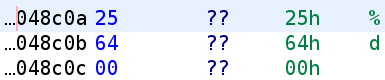

but the variables `short_day`, `short_month`, `short_year` have data type is `short`, which is %h. Interesting! That may cause to integer overflow. 

With scanf("%h"), we can only input maximum is 0x7fff (2 bytes) while with scanf("%d"), we can input up to 0x7fffffff (4 bytes). Because data type is short, so if we input 0x76543210, it just take 2 least significant bytes 0x3210 to check and 0x7654 are leave on stack.

So let's try with that input 0x7ffffff for day, month, year variables. But wait, let's change a little bit because those variable will be checked after input.

```
day: 0x7fff000a			# day = 10
month: 0x7fff000b		# month = 11
year: 0x7fff07d0		# year = 2000
```

After input day and month:

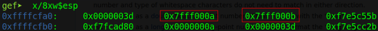

After input year:

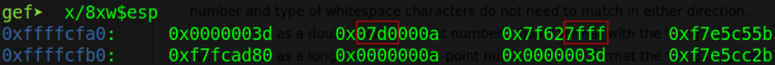

The image show that type short are just 2 bytes, the other 2 bytes are overwritten. But something has changed! There is something wrong `0x7f627fff`? Why it changed from 0x7fff (previous is input of month) to 0x7f62? 

Let's take a closer look on the program via gdb. After the input of month, there is a following code which change 0x7fff to 0x7f62

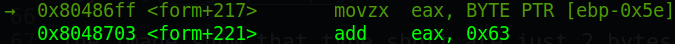

This code will get 0xff from input of month, add 0x63 will equal to 0x162, then it will get the least significant byte (which is 0x62) back to the place of 0xff. When we input our gender, the command become scanf(" %b") (char(0x62) = 'b'). 

That's all clear. We now can change 'c' to 's' to input whatever we want. Interestingly, after input of gender, there is printf() with format string in it. All we need after a successful change from scanf(" %c") to scanf(" %s") is insert %p to leak address

# 2. Brainstorming

- First idea:

We can use %p to leak address so we will leak stack canary, ebp and some address of libc. Then calculate one_gadget at put it at saved eip to spawn shell.

- Summary:

  - Leak stack canary, ebp and some address of libc

  - Buffer overflow with one_gadget

# 3. Conduct

- Step 1: Leak stack canary, ebp and some address

We know that input of gender can be change from char to string. Let's do some calculate and our input of month will be like this:

```
day: 0x0a
month: 0x10000b
year: 0x7b0
```

with `0x10` added with `0x63` will give us " %s".

Next, at scanf of gender, we just simply leak some address

Payload1: `MPPPPPPPPPPPPP%27$p%28$p%30$p`

%27$p for stack canary, %28$p for IO_2_1_stdin and %30$p for ebp.

After we get all leaked address and value, but we haven't downloaded libc yet, let's use address of IO_2_1_stdin and go to https://libc.blukat.me to download libc. As the challenge mentions `Ubuntu GLIBC 2.27-3ubuntu1.2`, so we just simply download libc 2.27 (there's just 1 libc with that version)

When downloaded the libc, we will use [patchelf](https://github.com/NixOS/patchelf) or [pwninit](https://github.com/io12/pwninit) to add libc to challenge file and fine one_gadget (there are too much but we just need to focus on the last one).

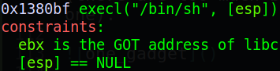

What is `GOT address of libc`? Well, that is just a readable and writeable memory address of libc. How to find it? We can use gdb (with [gef](https://github.com/hugsy/gef)) or readelf to get the offset and calculate the address.

In gdb, using `vmmap` to get GOT address, then calculate the offset by subtract address of read and write section (0xf7fca000) with libc base address (0xf7df2000):

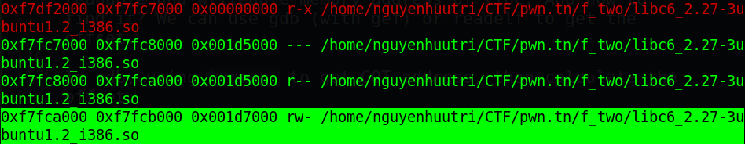

Or `readelf -d <libc name> | grep PLTGOT` and get the offset right away.

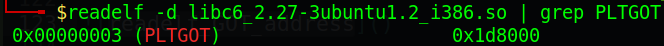

All 2 way above will give us 1 number: 0x1d8000.

Now, let's move on step 2.

- Step 2: buffer overflow with one_gadget

Because the one_gadget require GOT address of libc need to be in ebx, let's find a ROP to do that

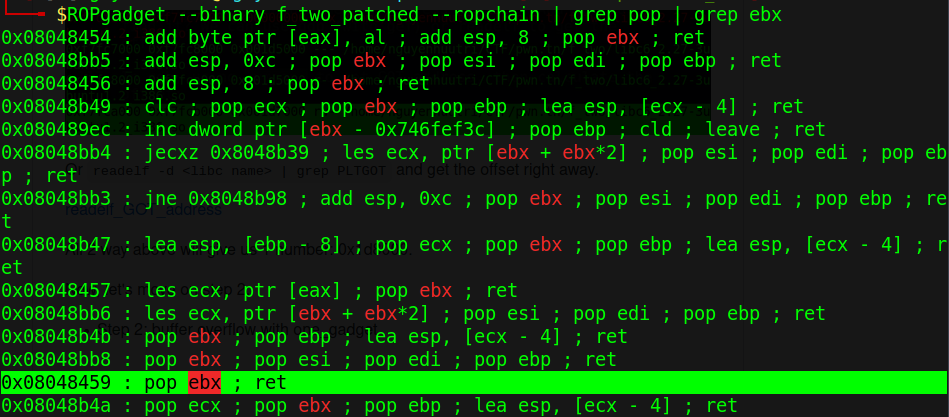

And we got all we need. Let's create our shell with the second payload (notice that esp need 4-byte null):

Format: `<padding> + <stack canary> + <padding> + <ebp> + <one_gadget> + "\x00\x00\x00\x00"`

Payload2 (in python): `"A"*50 + p32(<stack canary>) + payload.ljust(62, b'P') + p32(ebp) + p32(one_gadget)`

# 4. Get flag

This is my script: [solve.py](solve.py)

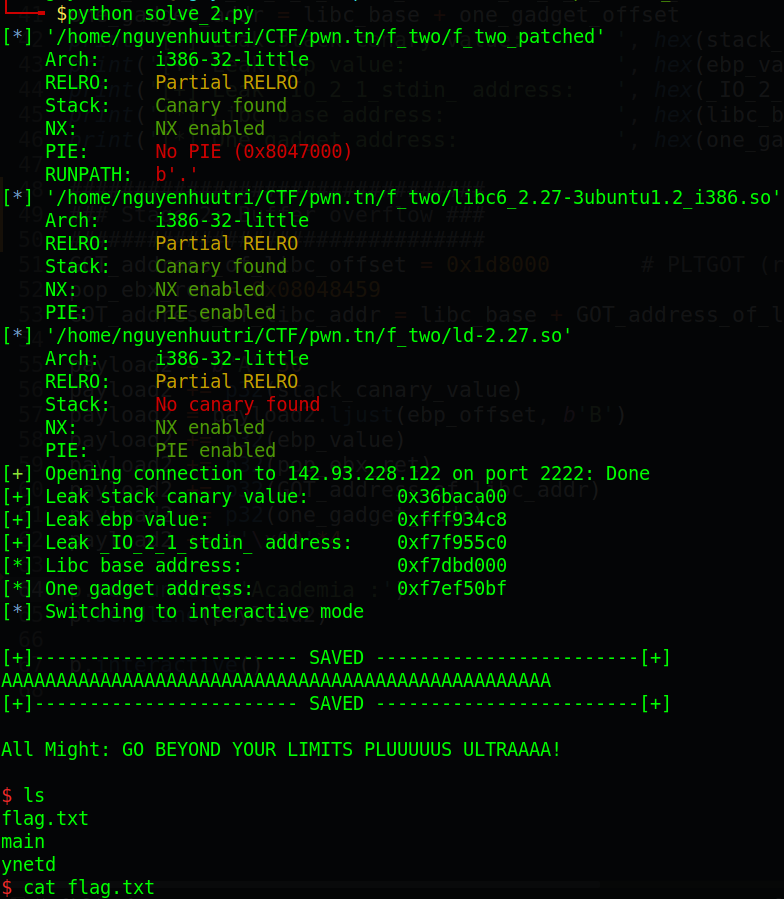